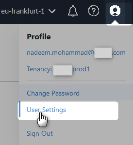

# Working With Oracle Cloud Infrastructure (OCI) CLI


## Installation

Refer [this](https://docs.cloud.oracle.com/iaas/Content/API/SDKDocs/cliinstall.htm) for more details on installation.


## Configure OCI CLI

Execute `oci setup config`

```Powershell
PS D:\nadeem> oci setup config
```

```Powershell
This command provides a walkthrough of creating a valid CLI config file.
 
The following links explain where to find the information required by this
script:
 
User OCID and Tenancy OCID:
 
    https://docs.us-phoenix-1.oraclecloud.com/Content/API/Concepts/apisigningkey.htm#Other
 
Region:
 
    https://docs.us-phoenix-1.oraclecloud.com/Content/General/Concepts/regions.htm
 
General config documentation:
 
    https://docs.us-phoenix-1.oraclecloud.com/Content/API/Concepts/sdkconfig.htm
```

Will go ahead and choose the default location, hit enter

```Powershell
Enter a location for your config [C:\Users\nadeem\.oci\config]:
```

```Powershell
Enter a location for your config [C:\Users\nadeem\.oci\config]:
```

Refer [this](GettingOCIDs.md) to get the OCIDs required below

Provide User OCID

```Powershell
Enter a user OCID: ocid1.user.oc1..xxxxxxxxxxxxxbyesk6wmajsgpae52sj6lyyyyyyyyyy
```
Provide Tenancy OCID

```Powershell
Enter a tenancy OCID: ocid1.tenancy.oc1..xxxxxxxxxxxxxxxx4bp2xinnnndy25ps6csc7yyyyyyyyyyyy
```
Provide region

```Powershell
Enter a region (e.g. ca-toronto-1, eu-frankfurt-1, uk-london-1, us-ashburn-1, us-phoenix-1): eu-frankfurt-1
```

Following would generate OCI API Key pair.

```Powershell
Do you want to generate a new RSA key pair? (If you decline you will be asked to supply the path to an existing key.) [Y/n]: Y
Enter a directory for your keys to be created [C:\Users\nadeem\.oci]:
Enter a name for your key [oci_api_key]:
Public key written to: C:\Users\nadeem\.oci\oci_api_key_public.pem
Enter a passphrase for your private key (empty for no passphrase):
Private key written to: C:\Users\nadeem\.oci\oci_api_key.pem
Fingerprint: b2:04:c3:ee:22:d0:85:83:b6:fa:24:9e:93:2f:c5:27
Config written to C:\Users\nadeem\.oci\config

 
    If you haven't already uploaded your public key through the console,
    follow the instructions on the page linked below in the section 'How to
    upload the public key':
 
        https://docs.us-phoenix-1.oraclecloud.com/Content/API/Concepts/apisigningkey.htm#How2
```
Copy public key

```Powershell
nadeem@NADEEM MINGW64 ~
$ cd .oci
 
nadeem@NADEEM MINGW64 ~/.oci
$ ls
config  oci_api_key.pem  oci_api_key_public.pem

```





Paste the key, copied earlier.


Public key added


Create oci-cli-rc file

```Powershell
PS C:\Users\nadeem\.oci> oci setup oci-cli-rc
```

The above would generate oci_cli_rc file under ~/.oci, add the following line in oci_cli_rc.

```Powershell
[DEFAULT]
compartment-id = [Add your compartment ocid]
```

## Playing With OCI CLI

```Powershell
PS C:\WINDOWS\system32> oci os ns get
{
  "data": "prod1"
}
```

```Powershell
PS C:\WINDOWS\system32>  oci iam region list --output table
+-----+----------------+
| key | name           |
+-----+----------------+
| FRA | eu-frankfurt-1 |
| IAD | us-ashburn-1   |
| LHR | uk-london-1    |
| PHX | us-phoenix-1   |
| YYZ | ca-toronto-1   |
+-----+----------------+
```

```Powershell
PS C:\WINDOWS\system32> oci iam availability-domain list
{
  "data": [
    {
      "compartment-id": "ocid1.compartment.oc1..fdfsfsd63xiwzpxyyanasfdsfsdfsd",
      "id": "ocid1.availabilitydomain.oc1..sdfasdfsafjxhrozpasfsdafsdf",
      "name": "iOTX:EU-FRANKFURT-1-AD-1"
    },
    {
      "compartment-id": "ocid1.compartment.oc1..sfasdcubqi7hu63xiasfasdfsadfsdf",
      "id": "ocid1.availabilitydomain.oc1..asfsdfptylx2l7jqbnyv4dygsafsdassafsadf",
      "name": "iOTX:EU-FRANKFURT-1-AD-2"
    },
    {
      "compartment-id": "ocid1.compartment.oc1..afsdadsfsfdsf3xiwzpxyyasfsdf",
      "id": "ocid1.availabilitydomain.oc1..afssadasdso3pmqcuqwjaasfsd",
      "name": "iOTX:EU-FRANKFURT-1-AD-3"
    }
  ]
}
```

# References
* [Install CLI](https://docs.cloud.oracle.com/iaas/Content/API/SDKDocs/cliinstall.htm)
* [Configure CLI](https://docs.cloud.oracle.com/iaas/Content/API/SDKDocs/cliconfigure.htm)
* [Required Keys and OCIDs](https://docs.cloud.oracle.com/iaas/Content/API/Concepts/apisigningkey.htm#How)
* [SDK CLI Configuration Files](https://docs.cloud.oracle.com/iaas/Content/API/Concepts/sdkconfig.htm)
* [OCI CLI Command ref](https://docs.cloud.oracle.com/iaas/tools/oci-cli/latest/oci_cli_docs/cmdref/setup/config.html)