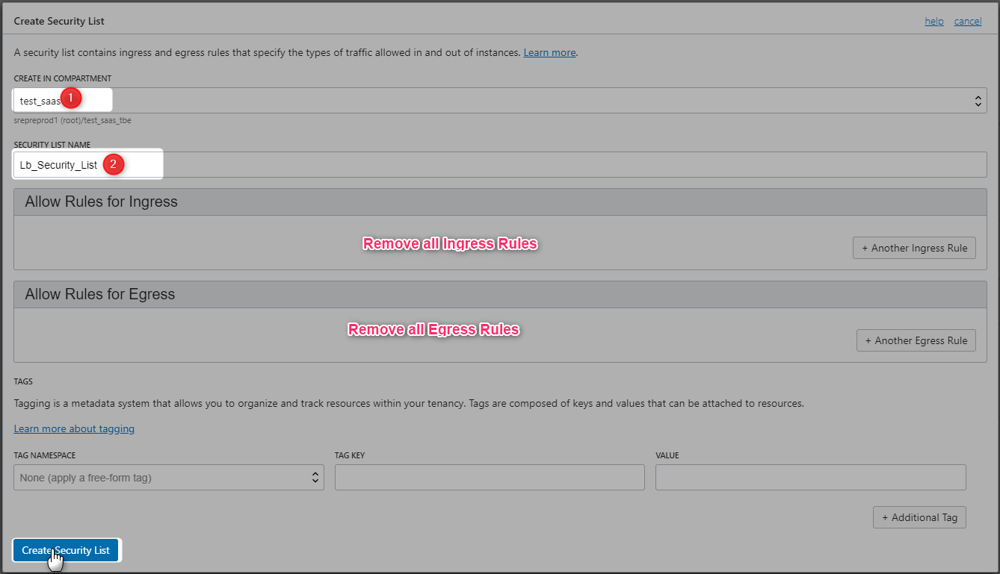

# Introduction 

* Load Balancer enables Automated traffic distribution 
* Load Balancer Improves resource utilization, facilitates scaling, and helps ensure high availability
* There are two types public and private 

# Design

Lets provision the following Infrastructure.

For the sake of simplicity lets focus only on the highlighted items.

# Prerequisites

### SSH

Make sure to generate the [SSH key Pari](GeneratingSshKey.md), ignore if already done

### VNC

Make sure to [create VCN](CreatingVCN.md), ignore if already done.

### Compute Instance

Make sure to [Create Compute Instance](CreatingComputeInstance.md), we would have to create two compute instances, ignore if already done.

# Implementation

## We need the following
* VCN
* Internet Gateway
* Two subnets for two Load Balancers
* One security list for LB Subnets
* One Route table for LB Subnets
* Load Balancers
* Two compute instances
* one subnet, security list, route table for backendset (Compute instances)

## Creating VCN

Lets [create VCN](CreatingVCN.md), and name it **public_lb_vcn**.

Since we have created above vcn with option **"Create Virtual Cloud Plus Related Resources"** it would create the following automatically.

* Subnets
* Rout Table
* Internet Gateway
* Security List and 
* DHCP Options

Will try to reuse some of it where ever applicable instead of creating new one.

## Create New Security List for Loadbalancer

Refer [this](https://docs.cloud.oracle.com/iaas/Content/Network/Concepts/securitylists.htm) for more details on SecurityList

## Crete New Route Table For Loadbalancer

# Testing

# Clean Up

# References
