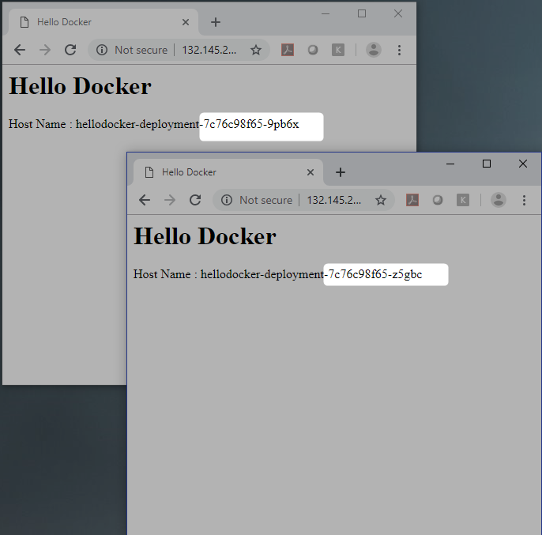

# Deploy Custom Docker Image Into OKE Cluster

We will do the Following

* Push custom Docker image to OCI Registry
* Deploy this custom docker image to OKE
* Scale it

## Prerequisites
* Make sure you have set up [OKE Cluster](OracleContainerEngineForKubernetes.md)
* Make sure you have pushed [Hello Docker](https://github.com/enabling-cloud/docker-learning/blob/master/HelloDockerImage.md) Image to [OCI Registry](OCIRegistry.md)


## Create Kubernetes seceret


#### Format
```Powershell
kubectl create secret docker-registry ocirsecret --docker-server=<region-code>.ocir.io --docker-username='<tenancy-name>/<oci-username>' --docker-password='<oci-auth-token>' --docker-email='<email-address>'
```

#### Actual Command
```Powershell
$ kubectl create secret docker-registry ocirsecret --docker-server=fra.ocir.io --docker-username='demo/nadeem@abc.com' --docker-password='A<AFDS}r2[754:{o>' --docker-email='nadeem@abc.com'
 
 
secret "ocirsecret" created
```

```Powershell
$ kubectl get secrets
NAME                  TYPE                                  DATA      AGE
default-token-g8xkv   kubernetes.io/service-account-token   3         20m
ocirsecret            kubernetes.io/dockerconfigjson        1         12s
```

## Create Kubenetes Manifest File

**hellodocker-lb.yml**
```Powershell
apiVersion: apps/v1
kind: Deployment
metadata:
  name: hellodocker-deployment
spec:
  selector:
    matchLabels:
      app: hellodocker
  replicas: 1
  template:
    metadata:
      labels:
        app: hellodocker
    spec:
      containers:
      - name: hellodocker  
        image: fra.ocir.io/demo/docker-registry/hellodocker:1.0
        ports:
        - containerPort: 80
      imagePullSecrets:
      - name: ocirsecret
---
apiVersion: v1
kind: Service
metadata:
  name: hellodocker-service
spec:
  type: LoadBalancer
  ports:
  - port: 80
    protocol: TCP
    targetPort: 80
  selector:
    app: hellodocker
```

image: <region-code>.ocir.io/<tenancy-name>/<repo-name>/<image-name>:<tag>


for imagePullSecrets specify the secreted created, in this case ocirsecret


Note initially there is only one replica

## Deploy kubernetes application

```Powershell
$ kubectl create -f hellodocker-lb.yml
deployment.apps "hellodocker-deployment" created
service "hellodocker-service" created
```

Observe there is only one deployment

```Powershell
$ kubectl get deployments
NAME                     DESIRED   CURRENT   UP-TO-DATE   AVAILABLE   AGE
hellodocker-deployment   1         1         1            1           29s
```


```Powershell
$ kubectl get pods -o wide
NAME                                      READY     STATUS    RESTARTS   AGE       IP           NODE
hellodocker-deployment-7c76c98f65-9pb6x   1/1       Running   0          38s       10.244.2.2   10.0.11.2
```
keep a note of external ip address

```Powershell
$ kubectl get services
NAME                  TYPE           CLUSTER-IP    EXTERNAL-IP      PORT(S)        AGE
hellodocker-service   LoadBalancer   10.96.89.63   132.145.246.30   80:31296/TCP   57s
kubernetes            ClusterIP      10.96.0.1     <none>           443/TCP        28m
```

OCI Loadbalancer would be automatically created.


Access the application with external ip address.


```Powershell
$ kubectl describe service hellodocker-service
Name:                     hellodocker-service
Namespace:                default
Labels:                   <none>
Annotations:              <none>
Selector:                 app=hellodocker
Type:                     LoadBalancer
IP:                       10.96.89.63
LoadBalancer Ingress:     132.145.246.30
Port:                     <unset>  80/TCP
TargetPort:               80/TCP
NodePort:                 <unset>  31296/TCP
Endpoints:                10.244.2.2:80
Session Affinity:         None
External Traffic Policy:  Cluster
Events:
  Type    Reason                Age   From                Message
  ----    ------                ----  ----                -------
  Normal  EnsuringLoadBalancer  4m    service-controller  Ensuring load balancer
  Normal  EnsuredLoadBalancer   3m    service-controller  Ensured load balancer
```

## Scale Deployment

```Powershell
$ kubectl get deployments
NAME                     DESIRED   CURRENT   UP-TO-DATE   AVAILABLE   AGE
hellodocker-deployment   1         1         1            1           4m
```

```Powershell
$ kubectl scale --replicas=4 deployment/hellodocker-deployment
deployment.extensions "hellodocker-deployment" scaled
```
scaled

```Powershell
$ kubectl get deployments
NAME                     DESIRED   CURRENT   UP-TO-DATE   AVAILABLE   AGE
hellodocker-deployment   4         4         4            4           6m
```


```Powershell
$ kubectl describe deployment hellodocker-deployment
Name:                   hellodocker-deployment
Namespace:              default
CreationTimestamp:      Tue, 02 Apr 2019 00:20:25 +0530
Labels:                 <none>
Annotations:            deployment.kubernetes.io/revision=1
Selector:               app=hellodocker
Replicas:               4 desired | 4 updated | 4 total | 4 available | 0 unavailable
StrategyType:           RollingUpdate
MinReadySeconds:        0
RollingUpdateStrategy:  25% max unavailable, 25% max surge
Pod Template:
  Labels:  app=hellodocker
  Containers:
   hellodocker:
    Image:        fra.ocir.io/srepreprod1/docker-registry/hellodocker:1.0
    Port:         80/TCP
    Host Port:    0/TCP
    Environment:  <none>
    Mounts:       <none>
  Volumes:        <none>
Conditions:
  Type           Status  Reason
  ----           ------  ------
  Progressing    True    NewReplicaSetAvailable
  Available      True    MinimumReplicasAvailable
OldReplicaSets:  <none>
NewReplicaSet:   hellodocker-deployment-7c76c98f65 (4/4 replicas created)
Events:
  Type    Reason             Age   From                   Message
  ----    ------             ----  ----                   -------
  Normal  ScalingReplicaSet  7m    deployment-controller  Scaled up replica set hellodocker-deployment-7c76c98f65 to 1
  Normal  ScalingReplicaSet  47s   deployment-controller  Scaled up replica set hellodocker-deployment-7c76c98f65 to 4
```

Note that host-name changes 




