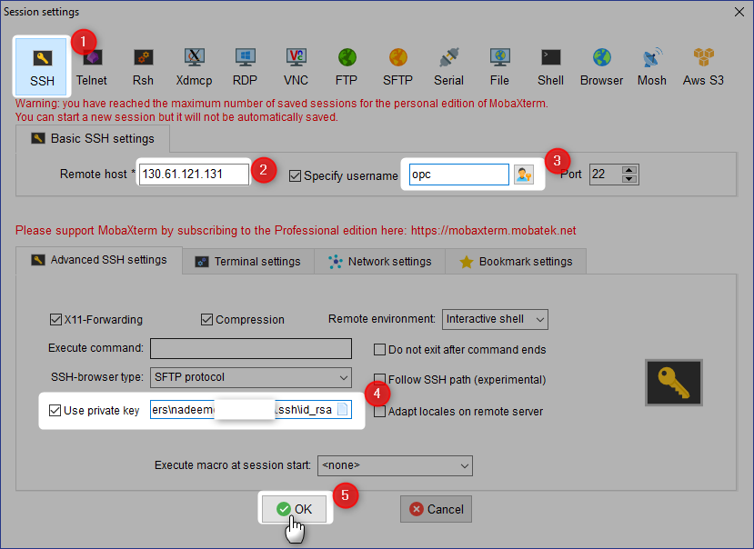
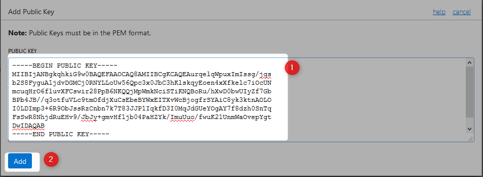
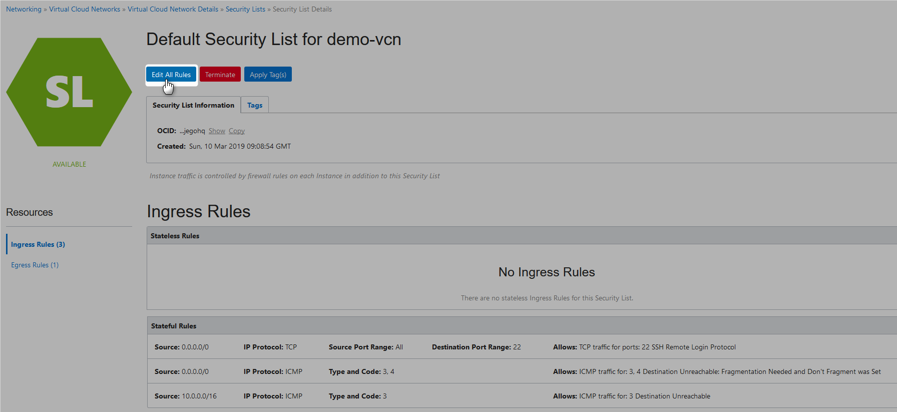
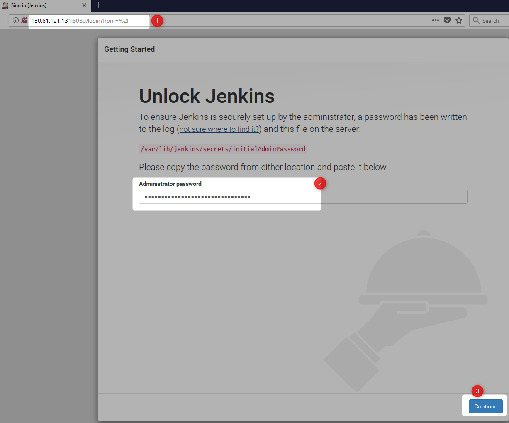
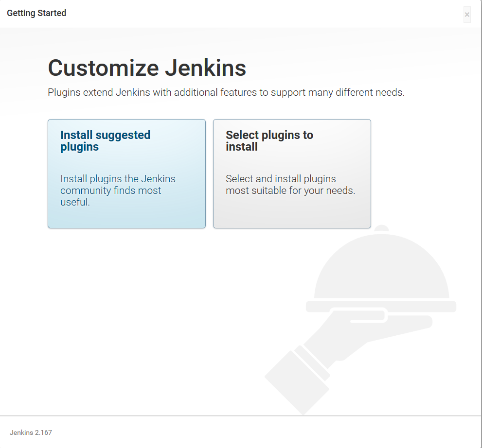
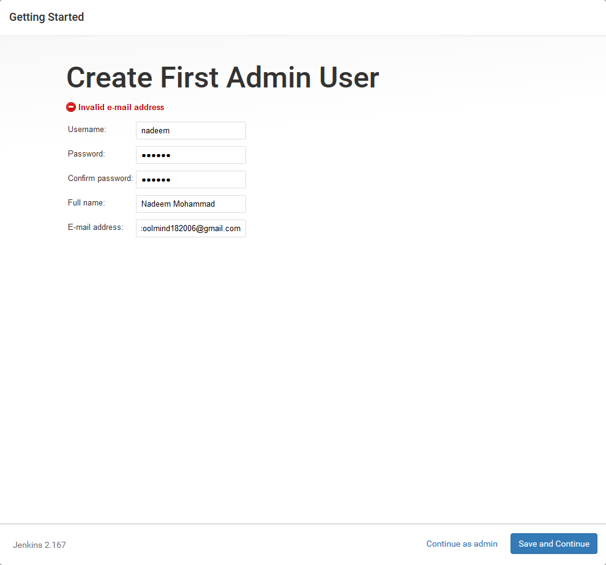
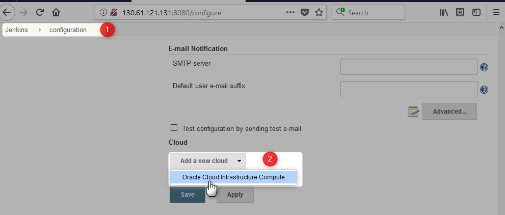
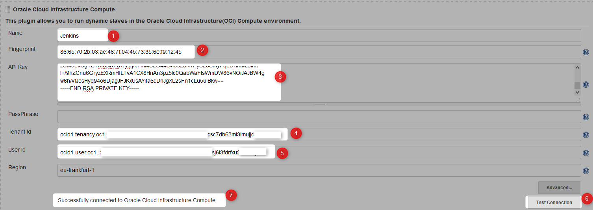
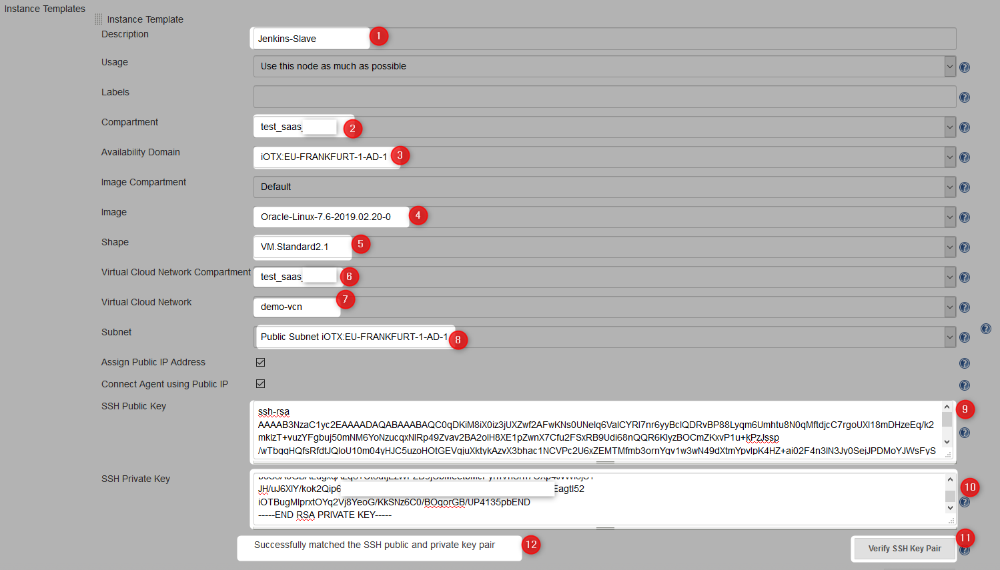
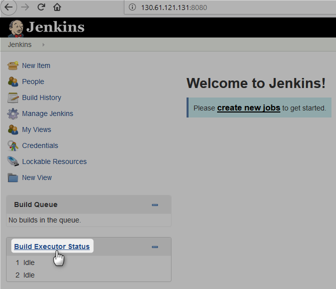

# Jenkins UP And Running On Oracle Cloud Infrastructure (OCI)

## Prerequisites

### SSH

Make sure to generate the [SSH key Pari](GeneratingSshKey.md), ignore if already done

### VNC

Make sure to [create VCN](CreatingVCN.md), ignore if already done.

### Compute Instance

[Create Compute Instance](CreatingComputeInstance.md)


## Install OCI Command Line Tool on Jenkins Compute Instance

OCIDs are required, before we go on installing OCI command line tool on jenkins instance. Grab your OCIDs by following [this](GettingOCIDs.md)
 


SSH into **130.61.121.131** (Provisioned Jenkins instance)



```Powershell
bash -c "$(curl –L https://raw.githubusercontent.com/oracle/oci-cli/master/scripts/install/install.sh)"
```

```Powershell
[opc@jenkins-instance ~]$ oci -v
2.5.2
[opc@jenkins-instance ~]$

```


```Powershell
[opc@jenkins-instance ~]$ oci setup config
    This command provides a walkthrough of creating a valid CLI config file.

    The following links explain where to find the information required by this
    script:

    User OCID and Tenancy OCID:

        https://docs.us-phoenix-1.oraclecloud.com/Content/API/Concepts/apisigningkey.htm#Other

    Region:

        https://docs.us-phoenix-1.oraclecloud.com/Content/General/Concepts/regions.htm

    General config documentation:

        https://docs.us-phoenix-1.oraclecloud.com/Content/API/Concepts/sdkconfig.htm


```

```Powershell
Enter a location for your config [/home/opc/.oci/config]:
Enter a user OCID: ocid1.user.oc1..xxxxxxxxxxxxxobyesk6wmajsgpae52sj6l3fdryyyyyyyyyyy
Enter a tenancy OCID: ocid1.tenancy.oc1..xxxxxxxxxxxxxxxivfpemlm5idy25ps6csc7db63ml3imuyyyyyyyyy
Enter a region (e.g. ca-toronto-1, eu-frankfurt-1, uk-london-1, us-ashburn-1, us-gov-ashburn-1, us-gov-chicago-1, us-gov-phoenix-1, us-langley-1, us-luke-1, us-phoenix-1): eu-frankfurt-1

```
Following keys (OCI Keys) would be used to provision Jenkins Slave nodes.


```Powershell
Do you want to generate a new RSA key pair? (If you decline you will be asked to supply the path to an existing key.) [Y/n]: Y
Enter a directory for your keys to be created [/home/opc/.oci]:
Enter a name for your key [oci_api_key]:
Public key written to: /home/opc/.oci/oci_api_key_public.pem
Enter a passphrase for your private key (empty for no passphrase):
Private key written to: /home/opc/.oci/oci_api_key.pem
Fingerprint: 86:65:70:2b:03:ae:46:7f:04:45:73:35:6e:f9:12:45
Config written to /home/opc/.oci/config


    If you haven't already uploaded your public key through the console,
    follow the instructions on the page linked below in the section 'How to
    upload the public key':

        https://docs.us-phoenix-1.oraclecloud.com/Content/API/Concepts/apisigningkey.htm#How2


[opc@jenkins-instance ~]$

```


```Powershell
[opc@jenkins-instance ~]$ cd /home/opc/.oci
[opc@jenkins-instance .oci]$ ls
config  oci_api_key.pem  oci_api_key_public.pem
[opc@jenkins-instance .oci]$

```
Public Key
```Powershell
[opc@jenkins-instance .oci]$ cat oci_api_key_public.pem
-----BEGIN PUBLIC KEY-----
MIIBIjANBgkqhkiG9w0BAQEFAAOCAQ8AMIIBCgKCAQEAurqelqWpuxImIssg/jqs
b2S8FyguA1jdvDGMCj0RNYLLoUw56Qpc3x0JbC3hKlskqyEoen4xXfkelc7iOcUN
mcuqHrO6fluvXFCswir28PpB6NKQQjMpWmkNciSTiKNQBoRu/hXwD0bwUIyZf7Gb
BPb4JB//q3otfuVLc9tmOfdjXuCsEbeBYWxEITXvWcBjogfrSYAiC8yk3ktnAOLO
I0LDImp3+6R9ObJssRzCnbn7k7T83JJP1IqkfD3I0MqJdGUeYOgAY7f8dzh0SnTq
FsSwR8NhjdRuEHv9/JbJy+gmvHf1jb04PaHZYk/ImuUuo/fwuK21UnmWaOvepYgt
DwIDAQAB
-----END PUBLIC KEY-----
[opc@jenkins-instance .oci]$

```

Add the above public key to your API Keys





## Install Jenkins In The Provisioned Instance

### Step 1 : Install Java

```Powershell
sudo yum install java –y
```
### Step 2 : Install Jenkins

```Powershell
sudo wget -O /etc/yum.repos.d/jenkins.repo http://pkg.jenkins-ci.org/redhat/jenkins.repo
```

```Powershell
sudo rpm --import https://jenkins-ci.org/redhat/jenkins-ci.org.key
```


```Powershell
sudo yum  install jenkins –y
```

```Powershell
[opc@jenkins-instance .oci]$ sudo service jenkins start
Starting jenkins (via systemctl):                          [  OK  ]
[opc@jenkins-instance .oci]$

```
### Step 3 : Punch a hole in the local firewall running on the VM to allow traffic through to port 8080

```Powershell
[opc@jenkins-instance .oci]$ sudo firewall-cmd --zone=public --permanent --add-port=8080/tcp
success
[opc@jenkins-instance .oci]$ 
```

```Powershell
[opc@jenkins-instance .oci]$ sudo firewall-cmd --reload
success
[opc@jenkins-instance .oci]$

```

### Step 4 :  Amend Security List

Go to VCNs


Click on the concerned VCN


Compute instance is available on AD1, click on corresponding subnet security list.


Click on Edit all rules



Add ingress rule, from anywhere to TCP port 8080


Rule added


Click on save


### Step 5 : Configure Jenkins

Goto Public IP Address : jenkins port

```Powershell
[opc@jenkins-instance .oci]$ sudo cat /var/lib/jenkins/secrets/initialAdminPassword
76dacbcc85bf4e13895c79c2ff64525b
[opc@jenkins-instance .oci]$

```
Admin first time login, use above password



customize



Plugins being installed


Configure first admin



Jenkins network config


Jenkins is ready to use


## Configure Master/Slave

### Step 1 :  Install Jenkins OCI Plugin


### Step 2 : Configure Jenkins OCI Plugin



API Key = [opc@jenkins-instance .oci]$ cat oci_api_key.pem

Fingerprint = finger print from file { [opc@jenkins-instance .oci] cat config ]



Click on **Add a new instance template**


Copy **SSH Public Key** to be used below, item 9

```Powershell
nadeem@nadeem-LAP MINGW64 ~/.ssh
$ clip < id_rsa.pub

nadeem@nadeem-LAP MINGW64 ~/.ssh$

```

Copy **SSH Private Key** to be used below, item 10

```Powershell
nadeem@nadeem-LAP MINGW64 ~/.ssh
$ clip < id_rsa

nadeem@nadeem-LAP MINGW64 ~/.ssh
$

```




Click on **Advanced**


Make sure to provide `sudo yum install java -y` for init script


Click **Save**

### Step 3 : Build Executor

Click on **Build Executor Status**



Click on **Jenkins-Slave** to provision new node


Node provisioning started


OCI compute VM being provisioned


Node provisioned


## Clean Up 


### Compute Instance

Refer [this](CreatingComputeInstance.md#termination) for more details on how to terminate compute instances.

**Note :** You would have to terminate two compute instances

### VCN

Refer [this](CreatingVCN.md#terminating-vcn) for more details on how to terminate VCN.


# References

* [Jenkins OCI Plugin](https://plugins.jenkins.io/oracle-cloud-infrastructure-compute)