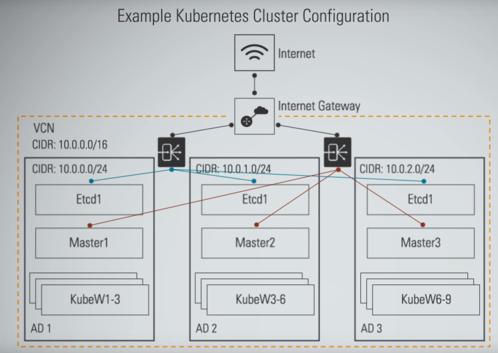
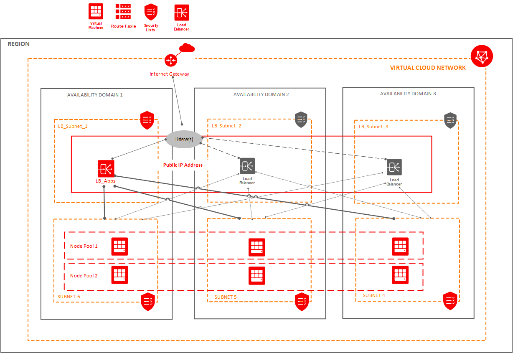
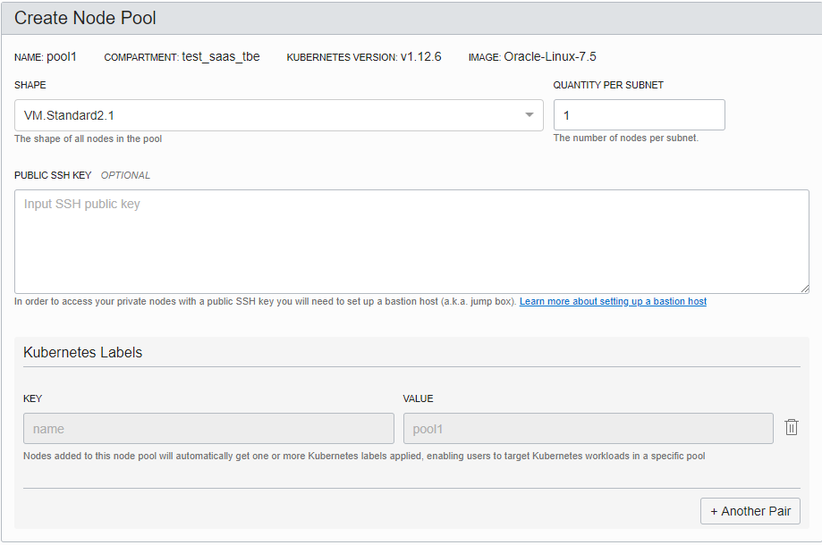
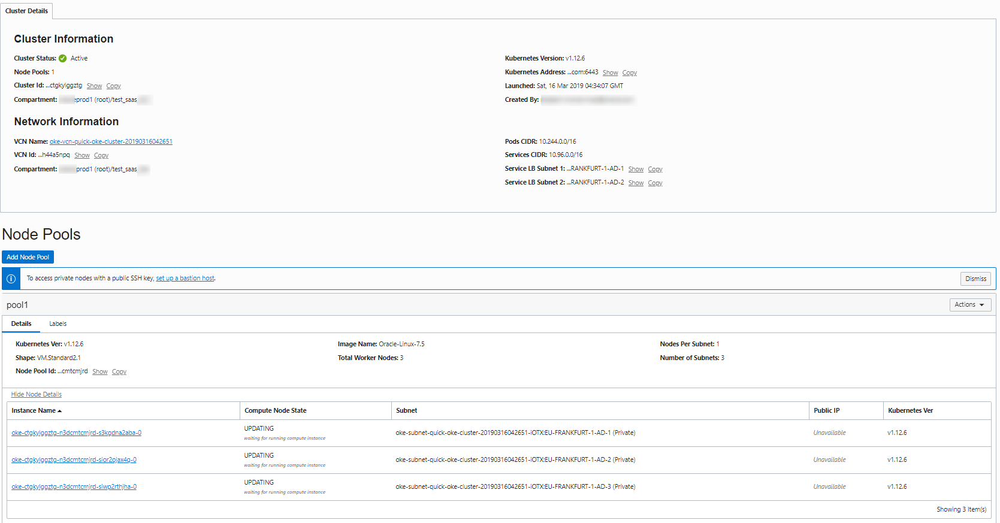
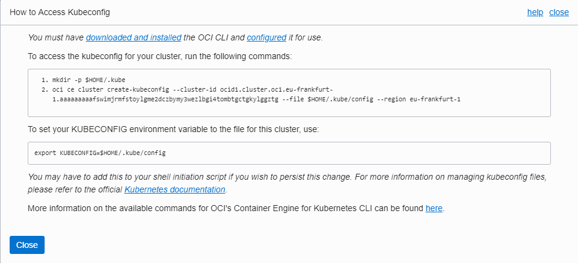
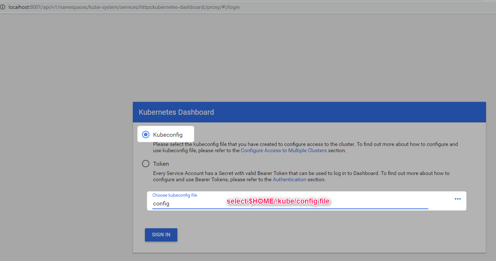
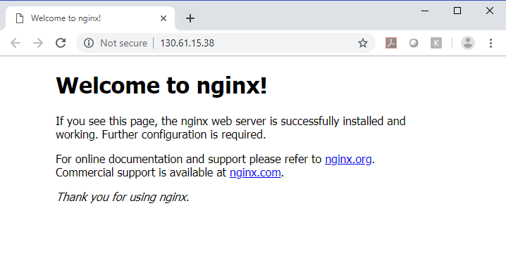

[Home](../README.md)

# Kubernetes Up And Running On Oracle Cloud Infrastructure (OCI)

Kubernetes Cluster Configuration



Normally ***Kubernetes Control Plane*** is not visible.



## Prerequisites

### SSH

Make sure to generate the [SSH key Pair](GeneratingSshKey.md), ignore if already done

### Policy 


Click **Create Policy**


```
allow service OKE to manage all-resources in tenancy

```
Alternatively
```
Allow group [group name] to manage all-resources in compartment [compartment name]

```

### OCI CLI

Following the instructions [here](OciCliUpAndRunningOnWindows.md) to install OCI CLI


### Kubernetes/Docker General Idea

Refer [this](https://github.com/enabling-cloud/kubernetes-learning) for more details on kubernetes.

Refer [this](https://github.com/enabling-cloud/docker-learning) for more details on Docker.


## Cluster Creation








## Setup Kubeconfig




```Powershell

PS C:\WINDOWS\system32> cd $HOME/.kube

PS C:\Users\nadeem\.kube> oci ce cluster create-kubeconfig --cluster-id ocid1.cluster.oc1.eu-frankfurt-1.aaaaaaaaafswimjrmfstoylgme2dczbymy3wezlbgi4tombtgctgkylggztg --file $HOME/.kube/config --region eu-frankfurt-1

Existing Kubeconfig file found at C:\Users\nadeem/.kube/config and new config merged into it
PS C:\Users\nadeem\.kube>
```

## Playing with Clustered Kubectl


```Powershell
PS C:\WINDOWS\system32> kubectl get nodes
NAME        STATUS    ROLES     AGE       VERSION
10.0.10.2   Ready     node      58m       v1.12.6
10.0.11.2   Ready     node      57m       v1.12.6
10.0.12.2   Ready     node      58m       v1.12.6
PS C:\WINDOWS\system32>

```


```Powershell
PS C:\WINDOWS\system32>  kubectl get services --all-namespaces
NAMESPACE     NAME                   TYPE        CLUSTER-IP      EXTERNAL-IP   PORT(S)         AGE
default       kubernetes             ClusterIP   10.96.0.1       <none>        443/TCP         1h
kube-system   kube-dns               ClusterIP   10.96.5.5       <none>        53/UDP,53/TCP   1h
kube-system   kubernetes-dashboard   ClusterIP   10.96.234.135   <none>        443/TCP         1h
kube-system   tiller-deploy          ClusterIP   10.96.147.168   <none>        44134/TCP       1h

```


```Powershell
PS C:\WINDOWS\system32> kubectl get pods --all-namespaces
NAMESPACE     NAME                                    READY     STATUS    RESTARTS   AGE
kube-system   kube-dns-7db5546bc6-78jww               3/3       Running   0          57m
kube-system   kube-dns-7db5546bc6-8tj9n               3/3       Running   0          58m
kube-system   kube-dns-7db5546bc6-mdfhz               3/3       Running   0          1h
kube-system   kube-dns-autoscaler-7fcbdf46bd-vshnq    1/1       Running   0          1h
kube-system   kube-flannel-ds-967c9                   1/1       Running   1          58m
kube-system   kube-flannel-ds-rm4g7                   1/1       Running   1          58m
kube-system   kube-flannel-ds-scrz7                   1/1       Running   1          57m
kube-system   kube-proxy-7m58l                        1/1       Running   0          58m
kube-system   kube-proxy-lcgdk                        1/1       Running   0          58m
kube-system   kube-proxy-w74bq                        1/1       Running   0          57m
kube-system   kubernetes-dashboard-7b96874d59-rkwxw   1/1       Running   0          1h
kube-system   proxymux-client-10.0.10.2               1/1       Running   0          58m
kube-system   proxymux-client-10.0.11.2               1/1       Running   0          57m
kube-system   proxymux-client-10.0.12.2               1/1       Running   0          58m
kube-system   tiller-deploy-864687d7f-76dcs           1/1       Running   0          1h
PS C:\WINDOWS\system32>

```


```Powershell
PS C:\WINDOWS\system32> kubectl get services
NAME         TYPE        CLUSTER-IP   EXTERNAL-IP   PORT(S)   AGE
kubernetes   ClusterIP   10.96.0.1    <none>        443/TCP   1h
PS C:\WINDOWS\system32>

```


```Powershell
PS C:\WINDOWS\system32> kubectl proxy
Starting to serve on 127.0.0.1:8001
```
Dashboard is available at http://localhost:8001/api/v1/namespaces/kube-system/services/https:kubernetes-dashboard:/proxy/





## Deployment

```Powershell
PS C:\WINDOWS\system32>  kubectl run nginx --image=nginx --port=80 --replicas=3
deployment.apps "nginx" created
PS C:\WINDOWS\system32>

```


```Powershell
PS C:\WINDOWS\system32> kubectl get deployments
NAME      DESIRED   CURRENT   UP-TO-DATE   AVAILABLE   AGE
nginx     3         3         3            3           10s

```


```Powershell
PS C:\WINDOWS\system32> kubectl get pods -o wide
NAME                    READY     STATUS    RESTARTS   AGE       IP           NODE
nginx-cdb6b5b95-6ld99   1/1       Running   0          15s       10.244.0.6   10.0.10.2
nginx-cdb6b5b95-94b2k   1/1       Running   0          15s       10.244.1.4   10.0.12.2
nginx-cdb6b5b95-v5lh8   1/1       Running   0          15s       10.244.2.2   10.0.11.2

```

Create a service to expose the application. The cluster is integrated with the OCI Cloud Controller Manager (CCM). As a result, creating a service of type –type=LoadBalancer will expose the pods to the Internet using an OCI Load Balancer.

```Powershell
PS C:\WINDOWS\system32> kubectl expose deployment nginx --port=80 --type=LoadBalancer
service "nginx" exposed
PS C:\WINDOWS\system32>

```

Loadbalancer is being provisioned


```Powershell
PS C:\WINDOWS\system32> kubectl get services
NAME         TYPE           CLUSTER-IP     EXTERNAL-IP   PORT(S)        AGE
kubernetes   ClusterIP      10.96.0.1      <none>        443/TCP        1h
nginx        LoadBalancer   10.96.126.18   <pending>     80:30033/TCP   12s
PS C:\WINDOWS\system32>


```

nginx up and running




## Clean up

```Powershell
PS C:\WINDOWS\system32> kubectl delete service nginx
service "nginx" deleted

```


```Powershell
PS C:\WINDOWS\system32> kubectl delete deployments nginx
deployment.extensions "nginx" deleted
PS C:\WINDOWS\system32>

```


# References
* [Container Engine](https://docs.cloud.oracle.com/iaas/Content/ContEng/Concepts/contengoverview.htm)
* [Containers FAQ](https://cloud.oracle.com/containers/faq)

