[Home](../README.md)


# Setting Up Public Load Balancer On Oracle Cloud Infrastructure (OCI) 

* Load Balancer enables Automated traffic distribution 
* Load Balancer Improves resource utilization, facilitates scaling, and helps ensure high availability
* There are two types public and private 


# Design

Lets provision the following Infrastructure.

For the sake of simplicity lets focus only on the highlighted items.

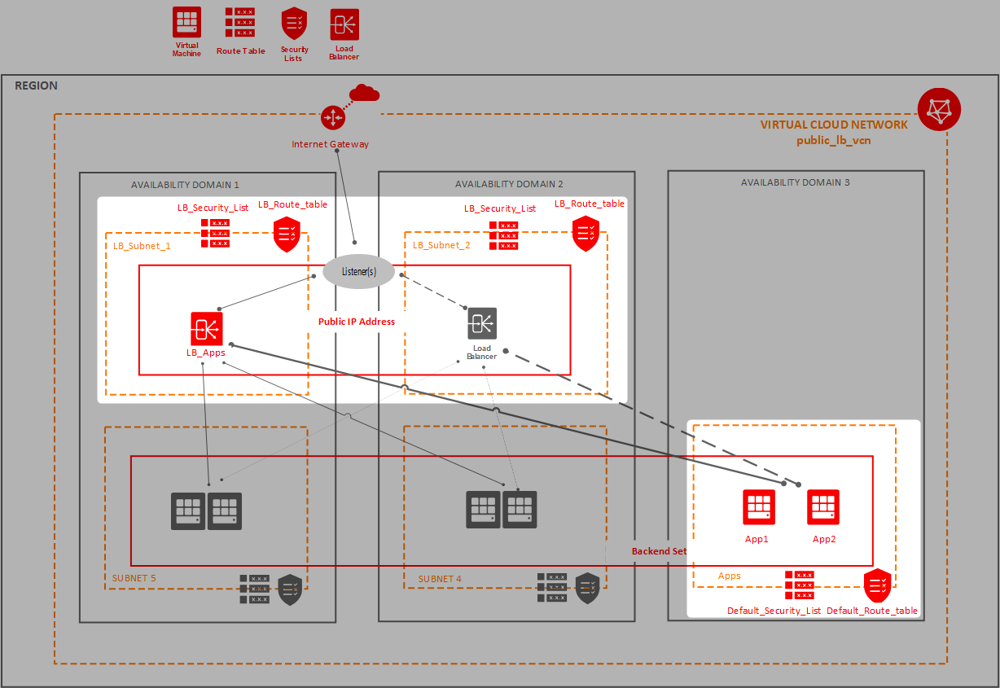


# Prerequisites

### SSH

Make sure to generate the [SSH key Pair](GeneratingSshKey.md), ignore if already done


# Implementation

## We need the following
* VCN
* Internet Gateway
* Two subnets for two Load Balancers
* One security list for LB Subnets
* One Route table for LB Subnets
* Load Balancers
* Two compute instances
* one subnet, security list, route table for backendset (Compute instances)


## Creating VCN

Lets [create VCN](CreatingVCN.md), and name it **public_lb_vcn**.


Since we have created above vcn with option **"Create Virtual Cloud Plus Related Resources"** it would create the following automatically.

* Subnets
* Rout Table
* Internet Gateway
* Security List and 
* DHCP Options

Will try to reuse some of it where ever applicable instead of creating new one.


## Create New Security List for Loadbalancer


Refer [this](https://docs.cloud.oracle.com/iaas/Content/Network/Concepts/securitylists.htm) for more details on SecurityList

## Crete New Route Table For Loadbalancer

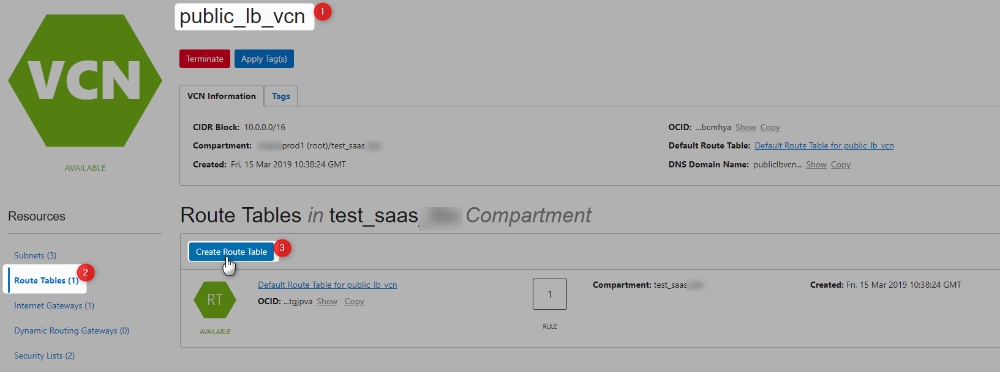

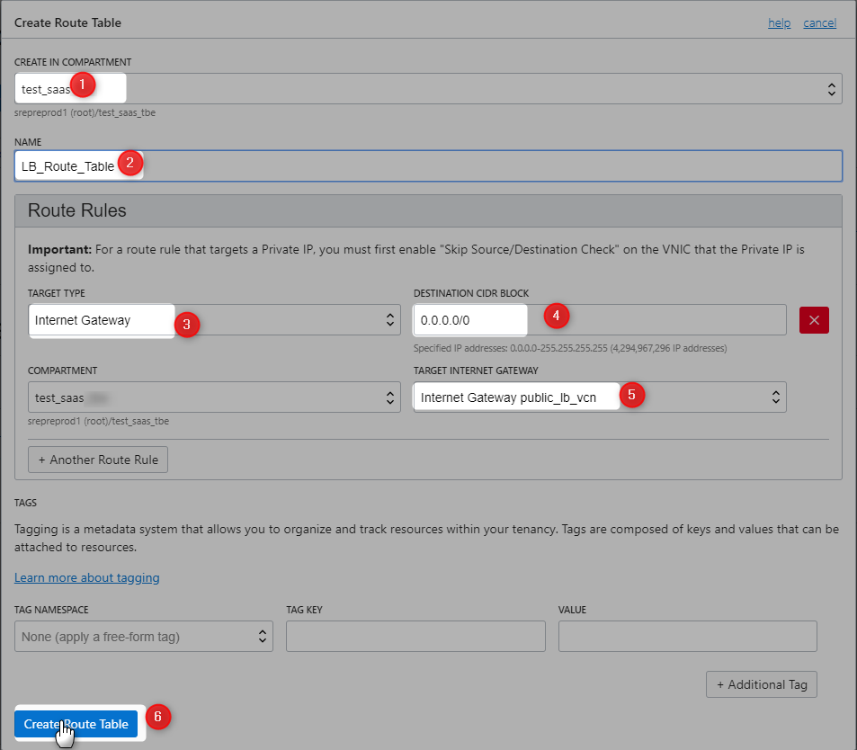


Refer [this](https://docs.cloud.oracle.com/iaas/Content/Network/Tasks/managingroutetables.htm) for more details on Routers

## Modify Existing Subnets

Will reuse existing 3 subnets from public_lb_vcn for this purpose

### AD-1 (LB_Subnet_1)

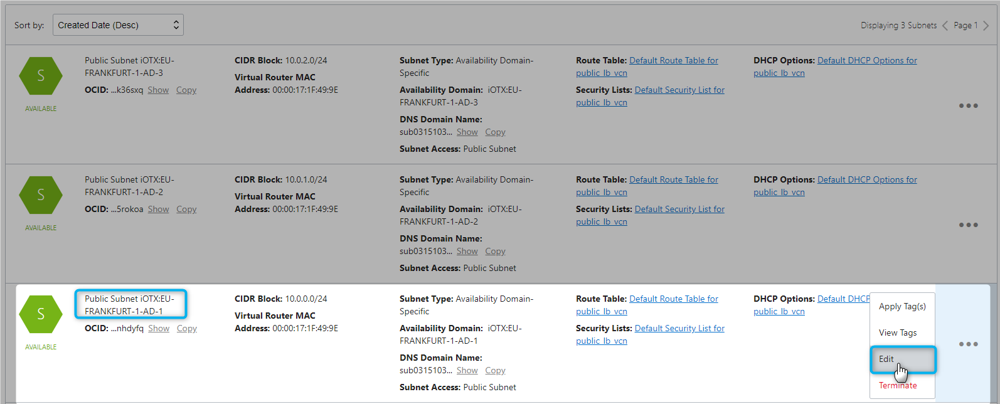

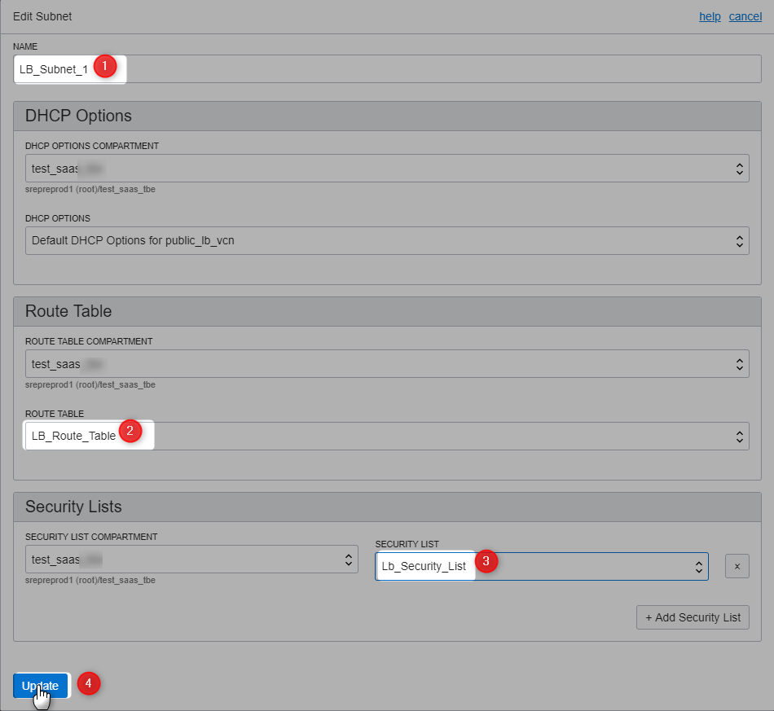


### AD-2 (LB_Subnet_2)

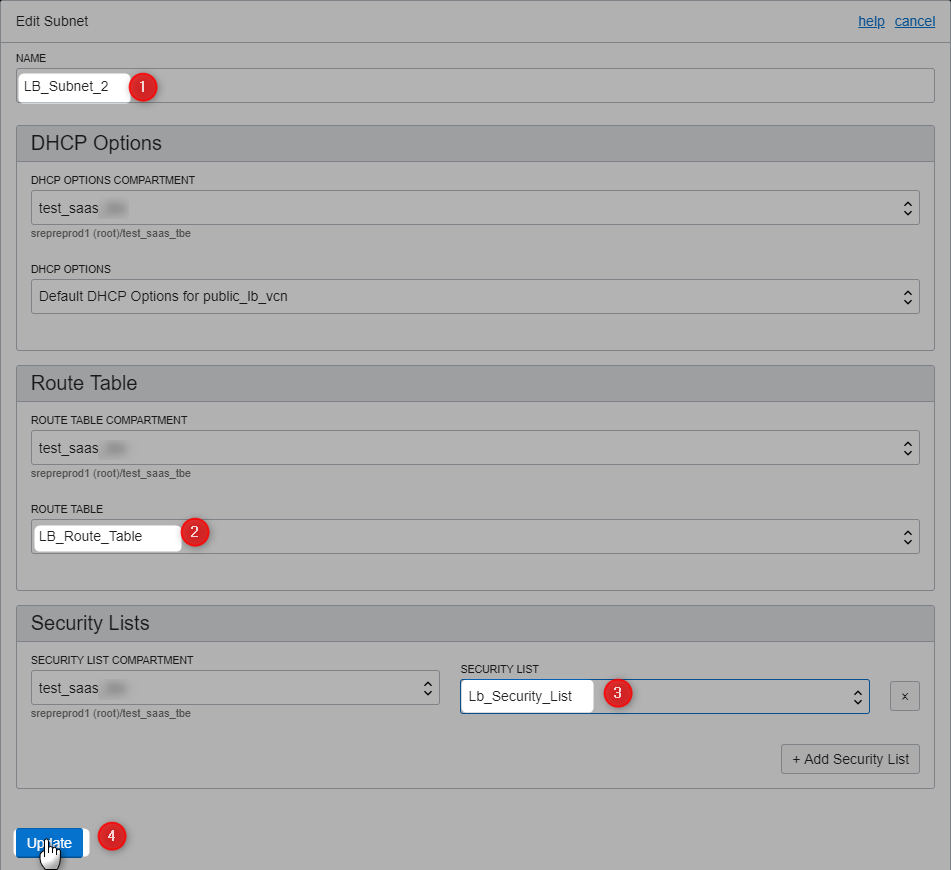

### AD-3 (Apps)

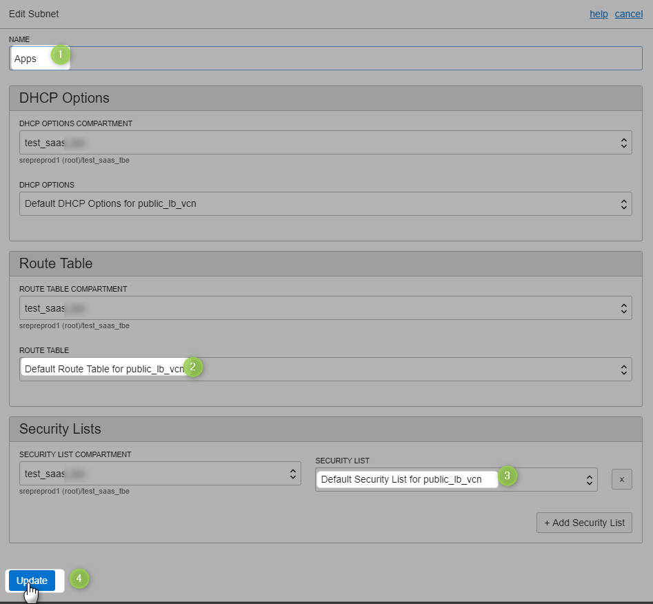

### All Subnets

Here are the updated subnets

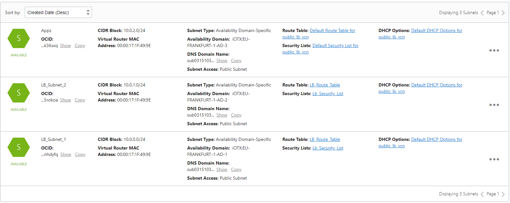


## Create Two App Compute Instances

Create two compute instances and do the following :

* Install Apache
* Firewalls opened to allow HTTP 
* Create index.html


Follow the steps in [Create Compute Instance](CreatingComputeInstance.md), to create two compute instances.


Refer [this](https://docs.cloud.oracle.com/iaas/Content/Compute/Concepts/computeoverview.htm) for more details on Compute Service

## App1

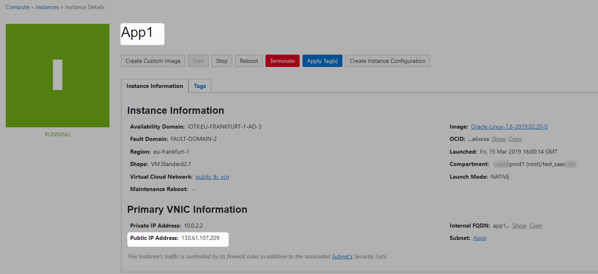

Lets connect


### Install Apache on App1

Install HTTP Server

```Powershell
sudo yum install httpd -y
```
Start Apache server

```Powershell
sudo apachectl start
```

Configure it to start after system reboot

```Powershell
 sudo systemctl enable httpd
```

Quick Check on configurations

```Powershell
[opc@app1 ~]$ sudo apachectl configtest
Syntax OK
[opc@app1 ~]$

```
Create firewall rules to allow access to the ports on which the HTTP server listens.

```Powershell
[opc@app1 ~]$  sudo firewall-cmd --permanent --zone=public --add-service=http
success
[opc@app1 ~]$ sudo firewall-cmd --reload
success
[opc@app1 ~]$

```

Create Index file for App1

```Powershell
sudo bash -c 'echo This is App1 running on OCI >> /var/www/html/index.html'
```

```Powershell
[opc@app1 ~]$ curl localhost
This is App1 running on OCI
[opc@app1 ~]$
```

## App2


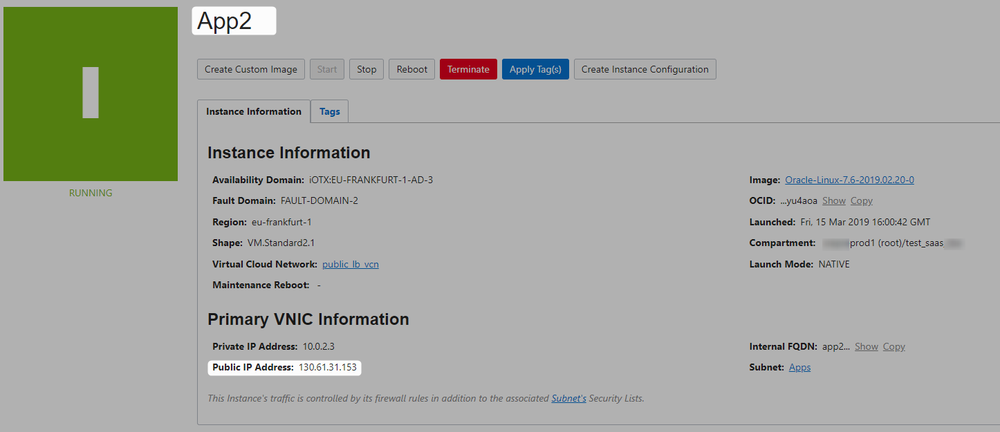

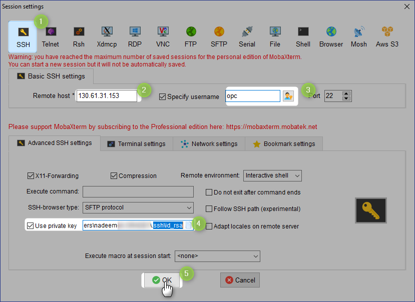

### Install Apache on App2

```Powershell
[opc@app2 ~]$ sudo yum install httpd -y

```

```Powershell
[opc@app2 ~]$ sudo apachectl start
```


```Powershell
[opc@app2 ~]$ sudo systemctl enable httpd
Created symlink from /etc/systemd/system/multi-user.target.wants/httpd.service to /usr/lib/systemd/system/httpd.service.

```

```Powershell
[opc@app2 ~]$ sudo apachectl configtest
Syntax OK

```

```Powershell
[opc@app2 ~]$ sudo firewall-cmd --permanent --zone=public --add-service=http
success
[opc@app2 ~]$  sudo firewall-cmd --reload
success

```

```Powershell
[opc@app2 ~]$ sudo bash -c 'echo This is App2 running on OCI >> /var/www/html/index.html'

```

```Powershell
[opc@app2 ~]$ curl localhost
This is App2 running on OCI
[opc@app2 ~]$

```

## Create Load Balancer

 

 

 

 


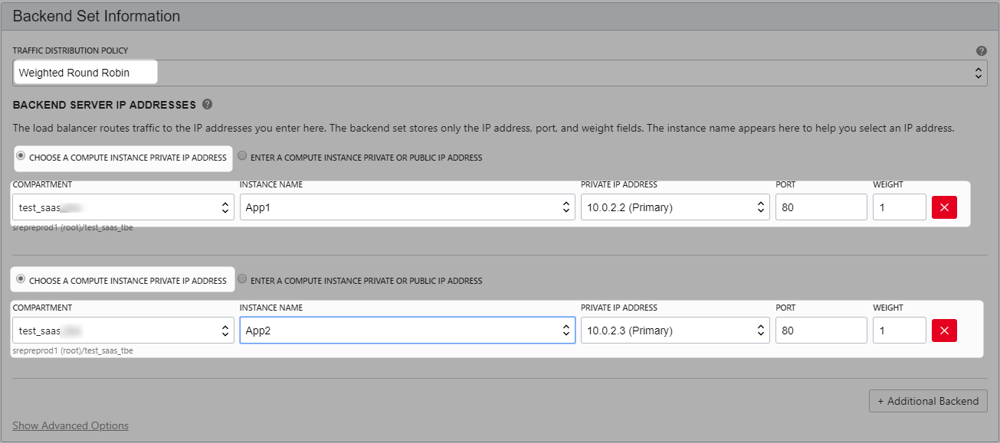

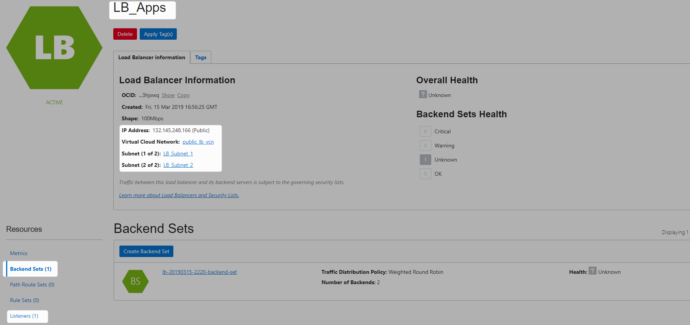


When a load balancer is created, you’re assigned a public IP address to which you route all incoming traffic.

The IP address is highly available, meaning it is available from both subnets that you specified.

Note that it is only active in one subnet at a time.

## Update SecurityList

Update LB_Security_List to allow internet traffic to listener.

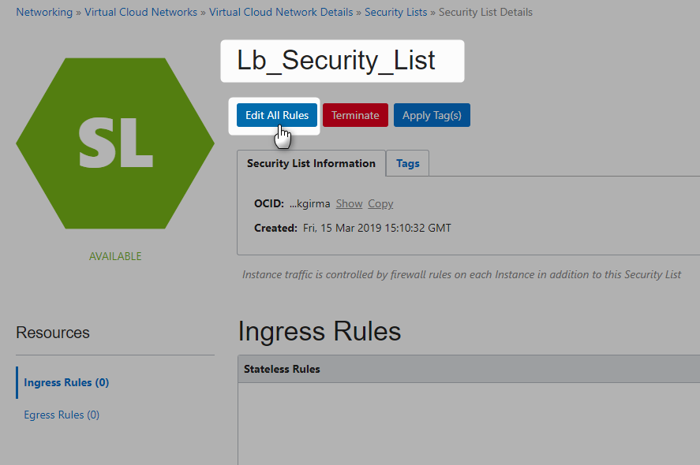


You would be updating both ingress and egress.


Update **Default Security List** to allow traffic from Load balancers to Apps


Subnet 1


Subnet 2


# Testing

If you get **502** wait for some more time.

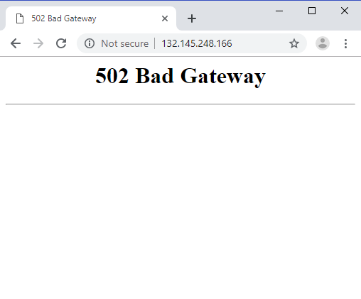

After some times it works

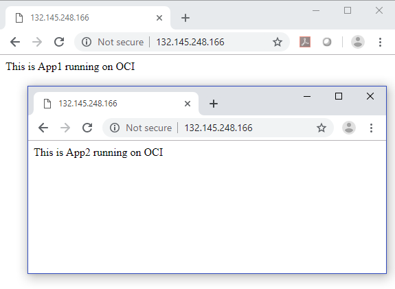


# Clean Up

### Locadbalancer

Terminate the load balancer


### Compute Instance

Terminate the two compute instances. Refer [this](CreatingComputeInstance.md#termination) for more details on how to terminate Compute instance.

### VCN

Termincate the VCN. Refer [this](CreatingVCN.md#terminating-vcn) for more details on how to terminate VCN.


# References

* [Getting Started With Loadbalancer](https://docs.cloud.oracle.com/iaas/Content/GSG/Tasks/loadbalancing.htm)
* [OCI Loadbalancer Document](https://docs.cloud.oracle.com/iaas/Content/Balance/Concepts/balanceoverview.htm)
* [OCI VCN Overview and Deployment Guide.pdf](https://cloud.oracle.com/iaas/whitepapers/vcn-deployment-guide.pdf)

