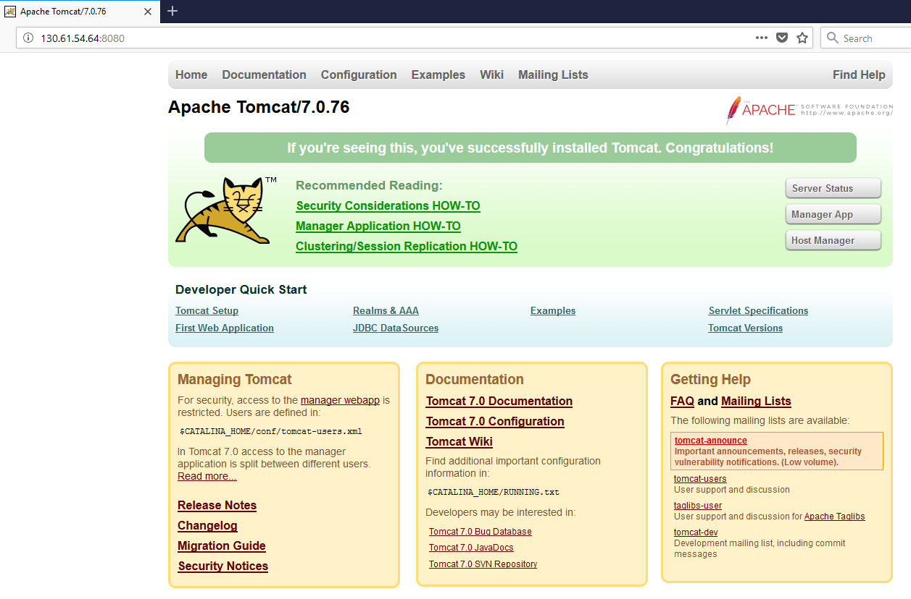

[](../README.md)

# Tomcat Up And Running On Oracle Cloud Infrastructure (OCI) Instance

## Prerequisites

### SSH

Make sure to generate the [SSH key Pair](GeneratingSshKey.md), ignore if already done

### VNC

Make sure to [create VCN](CreatingVCN.md), ignore if already done.

### Compute Instance

[Create Compute Instance](CreatingComputeInstance.md)


## Installation

Following the instruction [here](CreatingComputeInstance.md#connecting-to-provisioned-instance) to ssh into **130.61.54.64** (Public ip address of tomcat instance, just created)


Install Tomcat

```Powershell
[opc@tomcat-instance ~]$ sudo yum install -y tomcat tomcat-webapps tomcat-admin-webapps
```
Enable the Tomcat service with `systemctl` command, so it starts on server boot

```Powershell
[opc@tomcat-instance ~]$  sudo systemctl enable tomcat
Created symlink from /etc/systemd/system/multi-user.target.wants/tomcat.service to /usr/lib/systemd/system/tomcat.service.

```
Start the Tomcat service with this `systemctl` command

```Powershell
[opc@tomcat-instance ~]$  sudo systemctl start tomcat
```
Check the service started successfuly using the following command 

```Powershell
[opc@tomcat-instance ~]$ sudo systemctl status tomcat
● tomcat.service - Apache Tomcat Web Application Container
   Loaded: loaded (/usr/lib/systemd/system/tomcat.service; enabled; vendor preset: disabled)
   Active: active (running) since Sun 2019-03-10 11:54:53 GMT; 16s ago
 Main PID: 15663 (java)
   CGroup: /system.slice/tomcat.service
           └─15663 /usr/lib/jvm/jre/bin/java -classpath /usr/share/tomcat/bin/bootstrap.jar:/usr/share/tomcat/bin/tomcat-juli.jar:/usr/share/java/commons-daemon.jar -Dcatalina.base=/usr/share...

Mar 10 11:54:56 tomcat-instance server[15663]: Mar 10, 2019 11:54:56 AM org.apache.catalina.startup.TldConfig execute
Mar 10 11:54:56 tomcat-instance server[15663]: INFO: At least one JAR was scanned for TLDs yet contained no TLDs. Enable debug logging for this logger for a complete list of JARs ...lation time.
Mar 10 11:54:56 tomcat-instance server[15663]: Mar 10, 2019 11:54:56 AM org.apache.catalina.startup.HostConfig deployDirectory
Mar 10 11:54:56 tomcat-instance server[15663]: INFO: Deployment of web application directory /var/lib/tomcat/webapps/sample has finished in 263 ms
Mar 10 11:54:56 tomcat-instance server[15663]: Mar 10, 2019 11:54:56 AM org.apache.coyote.AbstractProtocol start
Mar 10 11:54:56 tomcat-instance server[15663]: INFO: Starting ProtocolHandler ["http-bio-8080"]
Mar 10 11:54:56 tomcat-instance server[15663]: Mar 10, 2019 11:54:56 AM org.apache.coyote.AbstractProtocol start
Mar 10 11:54:56 tomcat-instance server[15663]: INFO: Starting ProtocolHandler ["ajp-bio-8009"]
Mar 10 11:54:56 tomcat-instance server[15663]: Mar 10, 2019 11:54:56 AM org.apache.catalina.startup.Catalina start
Mar 10 11:54:56 tomcat-instance server[15663]: INFO: Server startup in 2177 ms
Hint: Some lines were ellipsized, use -l to show in full.
[opc@tomcat-instance ~]$

```

punch a hole in the local firewall running on the VM to allow traffic through to port 8080

```Powershell
[opc@tomcat-instance ~]$ sudo firewall-cmd --permanent --zone=public --add-port=8080/tcp
success

```
Reload the firewall

```Powershell
[opc@tomcat-instance ~]$ sudo firewall-cmd --reload
success
[opc@tomcat-instance ~]$
```
## Amend Security List

Go to VCNs


Click on the concerned VCN


Compute instance is available on AD1, click on corresponding subnet security list.


Click on Edit all rules


Add ingress rule, from anywhere to TCP port 8080


Rule added


Click on save


## Testing

goto compute-instance public ip address : tomcat port



## Clean Up 

### Compute Instance

Refer [this](CreatingComputeInstance.md#termination) for more details on how to terminate Compute instance.

### VCN

Refer [this](CreatingVCN.md#terminating-vcn) for more details on how to terminate VCN.

