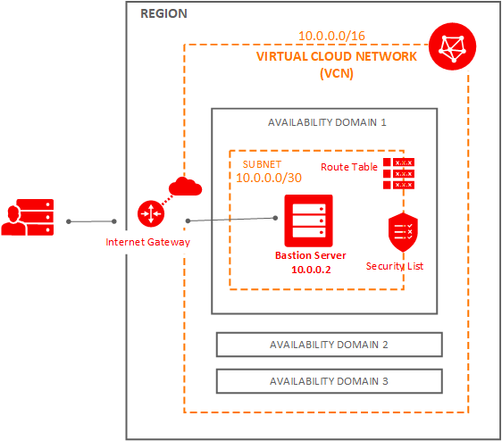

# Creating Bastion Compute Instance Using Terraform

## Bastion host

* Jump server to access instances in the private subnet
* A specialized computer that is deliberately exposed on a public network
* More on [Bastion host](https://cloud.oracle.com/iaas/whitepapers/bastion_hosts.pdf)

## Design

Lets provision the following infrastructure



## Implementation


### Terraform Project


### Terraform Code

Create **variable.tf** file and add the following


```Powershell
variable "tenancy_ocid" {}
variable "user_ocid" {}
variable "fingerprint" {}
variable "private_key_path" {}
variable "region" {}
variable "compartment_ocid" {}
 
variable "ssh_public_key_file" {
  default = "~/.ssh/id_rsa.pub"
}
 
# Choose an Availability Domain
variable "availability_domain" {
  default = "3"
}
 
variable "internet_gateway_enabled" {
  default = "true"
}
 
variable "instance_shape" {
  default = "VM.Standard2.1"
}
 
# Defines the number of instances to deploy
variable "NumInstances" {
  default = "1"
}
 
variable "BootStrapFile" {
  default = "./cloud-init/vm.cloud-config"
}
 
variable "instance_image_ocid" {
  type = "map"
 
  default = {
    // See https://docs.us-phoenix-1.oraclecloud.com/images/
    // Oracle-provided image "Oracle-Linux-7.5-2018.10.16-0"
    us-phoenix-1 = "ocid1.image.oc1.phx.aaaaaaaahu7hv6lqbdyncgwehipwsuh3htfuxcoxbl4arcetx6hzixft366a"
 
    us-ashburn-1   = "ocid1.image.oc1.iad.aaaaaaaab5l5wv7njknupfxvyynplhsygdz67uhfaz35nsnhsk3ufclqjaea"
    eu-frankfurt-1 = "ocid1.image.oc1.eu-frankfurt-1.aaaaaaaa527xpybx2azyhcz2oyk6f4lsvokyujajo73zuxnnhcnp7p24pgva"
    uk-london-1    = "ocid1.image.oc1.uk-london-1.aaaaaaaap5kk2lbo5lj3k5ff5tl755a4cszjwd6zii7jlcp6nz3gogh54wtq"
  }
}
```

Create **providers.tf** file and add the following

```Powershell
provider "oci" {
  tenancy_ocid     = "${var.tenancy_ocid}"
  user_ocid        = "${var.user_ocid}"
  fingerprint      = "${var.fingerprint}"
  private_key_path = "${var.private_key_path}"
  region           = "${var.region}"
}
```

Refer [this](https://www.terraform.io/docs/configuration/providers.html) for more detail on Providers

Create **env_vars.ps1** file and add the following (Windows)

```Powershell
### Authentication details
$env:TF_VAR_tenancy_ocid = "ocid1.tenancy.oc1..asfdsafsaffsafsadfdsafdsafsda"
$env:TF_VAR_user_ocid = "ocid1.user.oc1..asfdsafdsafdsafdsaf"
$env:TF_VAR_private_key_path = "C:\Users\nadeem.oci\oci_api_key.pem"
$env:TF_VAR_fingerprint = "5d:01:f7:11:95:96:6b:94:a1:90:ae:e8:09:59:b3:b1"
$env:TF_VAR_private_key_path = "C:\Users\nadeem\.oci\oci_api_key.pem"
$env:TF_VAR_ssh_public_key = "C:\Users\nadeem\.oci\oci_api_key.pem"
  
### Region
$env:TF_VAR_region  = "eu-frankfurt-1"
  
### Compartment
$env:TF_VAR_compartment_ocid  = "ocid1.compartment.oc1..asfdsafdsfsf"
```

execute `env_vars.ps1`

```Powershell
PS D:\practices\terraform\bastion> .\env_vars.ps1
PS D:\practices\terraform\bastion> $env:TF_VAR_region
eu-frankfurt-1
PS D:\practices\terraform\bastion> $env:TF_VAR_compartment_ocid
ocid1.compartment.oc1..aaaaaaaawbggxfhsizoqfpctlcubqi7hu63xiwzpxyyant625526x3zgxlga
PS D:\practices\terraform\bastion> $env:TF_VAR_private_key_path
C:\Users\nadeemoh.ORADEV\.oci\oci_api_key.pem
PS D:\practices\terraform\bastion> $env:TF_VAR_tenancy_ocid
ocid1.tenancy.oc1..aaaaaaaaysb24bp2xivfpemlm5idy25ps6csc7db63ml3imujjdpnbygrbna
PS D:\practices\terraform\bastion>
```


Create **datasources.tf** file and add the following 

```Powershell
# Gets a list of Availability Domains
data "oci_identity_availability_domains" "ADs" {
  compartment_id = "${var.tenancy_ocid}"
}
 
data "oci_core_images" "oracle_linux_image" {
  compartment_id           = "${var.tenancy_ocid}"
  operating_system         = "Oracle Linux"
  operating_system_version = "7.6"
}
```

Refer [this](https://www.terraform.io/docs/configuration/locals.html) for more details on locals

Refer [this](https://www.terraform.io/docs/providers/oci/d/identity_availability_domains.html) for more details on [datasource](https://www.terraform.io/docs/configuration/data-sources.html) oci_identity_availability_domains


Create **network.tf** file and add the following

```Powershell
resource "oci_core_vcn" "terraform_vcn" {
  #Required
  cidr_block     = "10.0.0.0/16"
  compartment_id = "${var.compartment_ocid}"
 
  #Optional
  dns_label    = "vcn1"
  display_name = "terraform-vcn"
}
```

Refer [this](https://www.terraform.io/docs/providers/oci/r/core_vcn.html) for more details on [resource](https://www.terraform.io/docs/configuration/resources.html) oci_core_vcn

Add the following to **network.tf**

```Powershell
resource "oci_core_security_list" "terraform_sl" {
  #Required
  compartment_id = "${var.compartment_ocid}"
  vcn_id         = "${oci_core_vcn.terraform_vcn.id}"
 
  egress_security_rules = [
    {
      destination = "0.0.0.0/0"
      protocol    = "all"
    },
  ]
 
  ingress_security_rules = [
    {
      protocol = "6"
      source   = "0.0.0.0/0"
 
      tcp_options {
        "max" = 22
        "min" = 22
      }
    },
    {
      protocol = "6"
      source   = "0.0.0.0/0"
 
      tcp_options {
        "max" = 80
        "min" = 80
      }
    },
  ]
 
  #Optional
  display_name = "terraform-sl"
}
```

Refer [this](https://www.terraform.io/docs/providers/oci/r/core_security_list.html) for more detail on oci_core_security_list

Add the following to **network.tf**

```Powershell
resource "oci_core_internet_gateway" "terraform_ig" {
  #Required
  compartment_id = "${var.compartment_ocid}"
  vcn_id         = "${oci_core_vcn.terraform_vcn.id}"
 
  #Optional
  enabled      = "${var.internet_gateway_enabled}"
  display_name = "terraform-gateway"
}
```

Refer [this](https://www.terraform.io/docs/providers/oci/r/core_internet_gateway.html) for more detail on oci_core_internet_gateway

Add the following to **network.tf**

```Powershell
resource "oci_core_route_table" "terraform_rt" {
  #Required
  compartment_id = "${var.compartment_ocid}"
  vcn_id         = "${oci_core_vcn.terraform_vcn.id}"
 
  route_rules {
    destination       = "0.0.0.0/0"
    network_entity_id = "${oci_core_internet_gateway.terraform_ig.id}"
  }
 
  #Optional
  display_name = "terraform-rt"
}
```
Refer [this](https://www.terraform.io/docs/providers/oci/r/core_route_table.html) for more detail on oci_core_route_table

Add the following to **network.tf**

```Powershell
resource "oci_core_subnet" "terraform_subnet" {
  #Required
  cidr_block        = "10.0.0.0/30"
  compartment_id    = "${var.compartment_ocid}"
  security_list_ids = ["${oci_core_security_list.terraform_sl.id}"]
  vcn_id            = "${oci_core_vcn.terraform_vcn.id}"
 
  #Optional
  availability_domain = "${lookup(data.oci_identity_availability_domains.ADs.availability_domains[var.availability_domain - 1], "name")}"
  dhcp_options_id     = "${oci_core_vcn.terraform_vcn.default_dhcp_options_id}"
  display_name        = "terraform_subnet"
  dns_label           = "terraformSubnet"
  route_table_id      = "${oci_core_route_table.terraform_rt.id}"
}
```

Refer [this](https://www.terraform.io/docs/providers/oci/r/core_subnet.html) for more detail on oci_core_subnet


Here is the final **network.tf**

```Powershell
resource "oci_core_vcn" "terraform_vcn" {
  #Required
  cidr_block     = "10.0.0.0/16"
  compartment_id = "${var.compartment_ocid}"
 
  #Optional
  dns_label    = "vcn1"
  display_name = "terraform-vcn"
}
 
resource "oci_core_security_list" "terraform_sl" {
  #Required
  compartment_id = "${var.compartment_ocid}"
  vcn_id         = "${oci_core_vcn.terraform_vcn.id}"
 
  egress_security_rules = [
    {
      destination = "0.0.0.0/0"
      protocol    = "all"
    },
  ]
 
  ingress_security_rules = [
    {
      protocol = "6"
      source   = "0.0.0.0/0"
 
      tcp_options {
        "max" = 22
        "min" = 22
      }
    },
    {
      protocol = "6"
      source   = "0.0.0.0/0"
 
      tcp_options {
        "max" = 80
        "min" = 80
      }
    },
  ]
 
  #Optional
  display_name = "terraform-sl"
}
 
resource "oci_core_internet_gateway" "terraform_ig" {
  #Required
  compartment_id = "${var.compartment_ocid}"
  vcn_id         = "${oci_core_vcn.terraform_vcn.id}"
 
  #Optional
  enabled      = "${var.internet_gateway_enabled}"
  display_name = "terraform-gateway"
}
 
resource "oci_core_route_table" "terraform_rt" {
  #Required
  compartment_id = "${var.compartment_ocid}"
  vcn_id         = "${oci_core_vcn.terraform_vcn.id}"
 
  route_rules {
    destination       = "0.0.0.0/0"
    network_entity_id = "${oci_core_internet_gateway.terraform_ig.id}"
  }
 
  #Optional
  display_name = "terraform-rt"
}
 
resource "oci_core_subnet" "terraform_subnet" {
  #Required
  cidr_block        = "10.0.0.0/30"
  compartment_id    = "${var.compartment_ocid}"
  security_list_ids = ["${oci_core_security_list.terraform_sl.id}"]
  vcn_id            = "${oci_core_vcn.terraform_vcn.id}"
 
  #Optional
  availability_domain = "${lookup(data.oci_identity_availability_domains.ADs.availability_domains[var.availability_domain - 1], "name")}"
  dhcp_options_id     = "${oci_core_vcn.terraform_vcn.default_dhcp_options_id}"
  display_name        = "terraform_subnet"
  dns_label           = "terraformSubnet"
  route_table_id      = "${oci_core_route_table.terraform_rt.id}"
}
```

Create **compute.tf** file and add the following

```Powershell
resource "oci_core_instance" "Bastion" {
  #Required 
  availability_domain = "${lookup(data.oci_identity_availability_domains.ADs.availability_domains[var.availability_domain - 1],"name")}"
  compartment_id      = "${var.compartment_ocid}"
  shape               = "${var.instance_shape}"
 
  #Optional
  count        = "${var.NumInstances}"
  display_name = "Bastion${count.index}"
 
  create_vnic_details {
    #Required 
    subnet_id = "${oci_core_subnet.terraform_subnet.id}"
 
    #Optional
    display_name     = "primaryvnic"
    assign_public_ip = true
    hostname_label   = "Bastion${count.index}"
    private_ip       = "10.0.0.2"
  }
 
  source_details {
    source_type = "image"
    source_id   = "${"${var.instance_image_ocid[var.region]}"}"
 
    # Apply this to set the size of the boot volume that's created for this instance.
    # Otherwise, the default boot volume size of the image is used.
    # This should only be specified when source_type is set to "image".
    #boot_volume_size_in_gbs = "60"
  }
 
  # Apply the following flag only if you wish to preserve the attached boot volume upon destroying this instance
  # Setting this and destroying the instance will result in a boot volume that should be managed outside of this config.
  # When changing this value, make sure to run 'terraform apply' so that it takes effect before the resource is destroyed.
  #preserve_boot_volume = true
 
  metadata {
    ssh_authorized_keys = "${file(var.ssh_public_key_file)}"
    user_data           = "${base64encode(file(var.BootStrapFile))}"
  }
  timeouts {
    create = "60m"
  }
}
```

Refer [this](https://www.terraform.io/docs/providers/oci/r/core_instance.html) for more detail on oci_core_instance

create file **cloud-init/vm.cloud-config** as follows

```Powershell
#!/bin/bash
yum update -y
```

Couple of more cloud-init sample files

* [Apache](https://github.com/wildahunden/saltdemo/blob/master/oci/webserver-cloud-init)
* [Saltstack app](https://github.com/wildahunden/saltdemo/blob/master/oci/salt-minion-cloud-init)


## Execution

```Powershell

```


```Powershell

```


```Powershell

```


```Powershell

```


```Powershell

```

