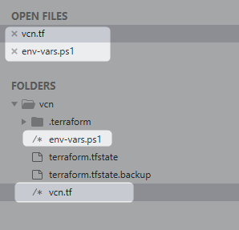

[](../README.md)

# Creating VCN Using Terraform On Oracle Cloud Infrastructure (OCI)

We need the following

* OCI Tenancy
* Terraform Installation
* Terraform OCI provider
* API SSL Key pair (Alternatively you can install OCI CLI)
* Terraform instructions


## OCI Tenancy

Refer [this](../manual/GettingOCIDs.md) to get more details on how to get details of OCI tenancy


## Terraform Installation

Download Terraform from [here](https://www.terraform.io/downloads.html)

The download contains a single executable file. Unzip it to a directory that is on your PATH.

```Powershell
PS C:\WINDOWS\system32> terraform -v
Terraform v0.11.11

PS C:\WINDOWS\system32>
```

## OCI CLI Installation

Refer this for more details on OCI CLI installation, this would generate API SSL Key pair in $HOME/.oci


```Powershell
nadeem@NADEEM-LAP MINGW64 ~/.oci
$ ls -la
total 46
drwxr-xr-x 1 nadeem 1049089    0 Mar  7 17:01 ./
drwxr-xr-x 1 nadeem 1049089    0 Mar 12 11:16 ../
-rw-r--r-- 1 nadeem 1049089  323 Mar 16 11:10 config
-rw-r--r-- 1 nadeem 1049089 1675 Mar 16 11:10 oci_api_key.pem
-rw-r--r-- 1 nadeem 1049089  451 Mar 16 11:10 oci_api_key_public.pem
-rw-r--r-- 1 nadeem 1049089 2869 Mar  7 17:03 oci_cli_rc

nadeem@NADEEM-LAP MINGW64 ~/.oci

```

Alternatively refer [this](GeneratingAPISigningKey.md) if you just want to generate teh API SSL Key Pair.

## Terraform Instructions


Create a file vcn.tf, and add the following content

```Powershell
variable "tenancy_ocid" {}
variable "user_ocid" {}
variable "fingerprint" {}
variable "private_key_path" {}
variable "compartment_ocid" {}
variable "region" {}

provider "oci" {
  tenancy_ocid     = "${var.tenancy_ocid}"
  user_ocid        = "${var.user_ocid}"
  fingerprint      = "${var.fingerprint}"
  private_key_path = "${var.private_key_path}"
  region           = "${var.region}"
}

resource "oci_core_virtual_network" "terraform-vcn" {
  cidr_block     = "10.0.0.0/16"
  dns_label      = "vcn1"
  compartment_id = "${var.compartment_ocid}"
  display_name   = "terraform-vcn"
}

```

Create a file env-vars.ps1, and add the following content 

```Powershell
### Authentication details
setx TF_VAR_tenancy_ocid ocid1.tenancy.oc1..sfdsafdsafdsafdsafdsafdsafdsafdsafdsaf
setx TF_VAR_user_ocid ocid1.user.oc1..afdsafdsafdsafdsafdsafasdfdsafdsafsafdasdfaasdfsdafdsa
setx TF_VAR_fingerprint 5d:01:f7:11:33:96:6b:84:a1:64:ae:e9:09:59:b3:a4
setx TF_VAR_private_key_path C:\Users\nadeem\.oci\oci_api_key.pem

### Region
setx TF_VAR_region eu-frankfurt-1

### Compartment
setx TF_VAR_compartment_ocid ocid1.compartment.oc1..asfdsafdsfdsafdsafsdafdsafdsafdsafsad
```



Open powershell and execute

```Powershell
PS D:\practices\terraform\vcn> .\env-vars.ps1

SUCCESS: Specified value was saved.

SUCCESS: Specified value was saved.

SUCCESS: Specified value was saved.

SUCCESS: Specified value was saved.

SUCCESS: Specified value was saved.

SUCCESS: Specified value was saved.

```

execute `terraform init`


```Powershell
PS D:\practices\terraform\vcn> terraform init
Terraform initialized in an empty directory!

The directory has no Terraform configuration files. You may begin working
with Terraform immediately by creating Terraform configuration files.
PS D:\practices\terraform\vcn> terraform init

Initializing provider plugins...
- Checking for available provider plugins on https://releases.hashicorp.com...
- Downloading plugin for provider "oci" (3.16.0)...

The following providers do not have any version constraints in configuration,
so the latest version was installed.

To prevent automatic upgrades to new major versions that may contain breaking
changes, it is recommended to add version = "..." constraints to the
corresponding provider blocks in configuration, with the constraint strings
suggested below.

* provider.oci: version = "~> 3.16"

Terraform has been successfully initialized!

You may now begin working with Terraform. Try running "terraform plan" to see
any changes that are required for your infrastructure. All Terraform commands
should now work.

If you ever set or change modules or backend configuration for Terraform,
rerun this command to reinitialize your working directory. If you forget, other
commands will detect it and remind you to do so if necessary.
```

Execute `terraform plan`

```Powershell
PS D:\practices\terraform\vcn> terraform plan
Refreshing Terraform state in-memory prior to plan...
The refreshed state will be used to calculate this plan, but will not be
persisted to local or remote state storage.


------------------------------------------------------------------------

An execution plan has been generated and is shown below.
Resource actions are indicated with the following symbols:
  + create

Terraform will perform the following actions:

  + oci_core_virtual_network.terraform-vcn
      id:                       <computed>
      cidr_block:               "10.0.0.0/16"
      compartment_id:           "ocid1.compartment.oc1..sfadsfsaaaafasdfdsafsadfdsfdsafdsafsadfs"
      default_dhcp_options_id:  <computed>
      default_route_table_id:   <computed>
      default_security_list_id: <computed>
      display_name:             "terraform-vcn"
      dns_label:                "vcn1"
      freeform_tags.%:          <computed>
      state:                    <computed>
      time_created:             <computed>
      vcn_domain_name:          <computed>


Plan: 1 to add, 0 to change, 0 to destroy.

------------------------------------------------------------------------

Note: You didn't specify an "-out" parameter to save this plan, so Terraform
can't guarantee that exactly these actions will be performed if
"terraform apply" is subsequently run.
```

Execute `terraform apply`

```Powershell
PS D:\practices\terraform\vcn> terraform apply

An execution plan has been generated and is shown below.
Resource actions are indicated with the following symbols:
  + create

Terraform will perform the following actions:

  + oci_core_virtual_network.terraform-vcn
      id:                       <computed>
      cidr_block:               "10.0.0.0/16"
      compartment_id:           "ocid1.compartment.oc1..afdsafdsafdsafdsafsadfdsafdsaf"
      default_dhcp_options_id:  <computed>
      default_route_table_id:   <computed>
      default_security_list_id: <computed>
      display_name:             "terraform-vcn"
      dns_label:                "vcn1"
      freeform_tags.%:          <computed>
      state:                    <computed>
      time_created:             <computed>
      vcn_domain_name:          <computed>


Plan: 1 to add, 0 to change, 0 to destroy.

Do you want to perform these actions?
  Terraform will perform the actions described above.
  Only 'yes' will be accepted to approve.

  Enter a value: yes

oci_core_virtual_network.terraform-vcn: Creating...
  cidr_block:               "" => "10.0.0.0/16"
  compartment_id:           "" => "ocid1.compartment.oc1..afdsafdsafdsafsadfsd"
  default_dhcp_options_id:  "" => "<computed>"
  default_route_table_id:   "" => "<computed>"
  default_security_list_id: "" => "<computed>"
  display_name:             "" => "terraform-vcn"
  dns_label:                "" => "vcn1"
  freeform_tags.%:          "" => "<computed>"
  state:                    "" => "<computed>"
  time_created:             "" => "<computed>"
  vcn_domain_name:          "" => "<computed>"
oci_core_virtual_network.terraform-vcn: Creation complete after 8s (ID: ocid1.vcn.oc1.eu-frankfurt-1.aaaaaaaayl...afsafdsfdsfsdafdsa)

Apply complete! Resources: 1 added, 0 changed, 0 destroyed.
PS D:\practices\terraform\vcn>
```

VCN created


Refer [this](https://github.com/terraform-providers/terraform-provider-oci/tree/master/docs/examples) for more examples

Refer the [official docs](https://www.terraform.io/docs/providers/oci/r/core_vcn.html) for vcn for more details


## Clean UP

Execute `terraform destroy`

```Powershell
D:\practices\terraform\vcn>terraform destroy
oci_core_virtual_network.terraform-vcn: Refreshing state... (ID: ocid1.vcn.oc1.eu-frankfurt-1.aaaaaaaayl...asfdsafsdafsdfsda)

An execution plan has been generated and is shown below.
Resource actions are indicated with the following symbols:
  - destroy

Terraform will perform the following actions:

  - oci_core_virtual_network.terraform-vcn


Plan: 0 to add, 0 to change, 1 to destroy.

Do you really want to destroy all resources?
  Terraform will destroy all your managed infrastructure, as shown above.
  There is no undo. Only 'yes' will be accepted to confirm.

  Enter a value: yes

oci_core_virtual_network.terraform-vcn: Destroying... (ID: ocid1.vcn.oc1.eu-frankfurt-1.aaaaaaaayl...asfdsafsadfdsafsa)
oci_core_virtual_network.terraform-vcn: Destruction complete after 1s

Destroy complete! Resources: 1 destroyed.

D:\practices\terraform\vcn>
```

VCN is deleted


## Terraform Console

```Powershell
D:\practices\terraform\vcn>terraform console
[J> var.region
eu-frankfurt-1
[J> var.fingerprint
5d:01:f7:22:95:96:6b:84:d2:60:er:e9:09:33:c3:b1
[J>
```

# References

* [Configure Terraform in Windows Systems](https://docs.oracle.com/en/solutions/infrastructure-components-to-deploy-peoplesoft/ebs-configuring-terraform-windows-systems.html#GUID-32007087-1FC8-4F4B-A129-AEC78F63FAB8)
* [Terraform CLI](https://www.terraform.io/docs/configuration/resources.html)
* [Terraform OCI Provider](https://github.com/terraform-providers/terraform-provider-oci)
* [Terraform OCI provider Examples](https://github.com/terraform-providers/terraform-provider-oci/tree/master/docs/examples)
* [Terraform examples](https://github.com/davipiala/terraform-examples/blob/master/oracle-linux-instance/env_vars)
* [Terraform Book](https://terraformbook.com/TheTerraformBook_sample.pdf)
* [Oracle Cloud Infrastructure Provider](https://www.terraform.io/docs/providers/oci/index.html)
* [Getting Started with Terraform Provider](https://docs.cloud.oracle.com/iaas/Content/API/SDKDocs/terraformgetstarted.htm)
* [Oracle Terraform Cloud Assets](https://github.com/oracle/cloud-asset-appsul-terraform-samples)
