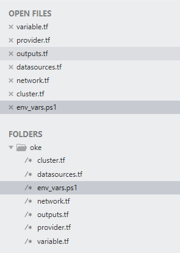
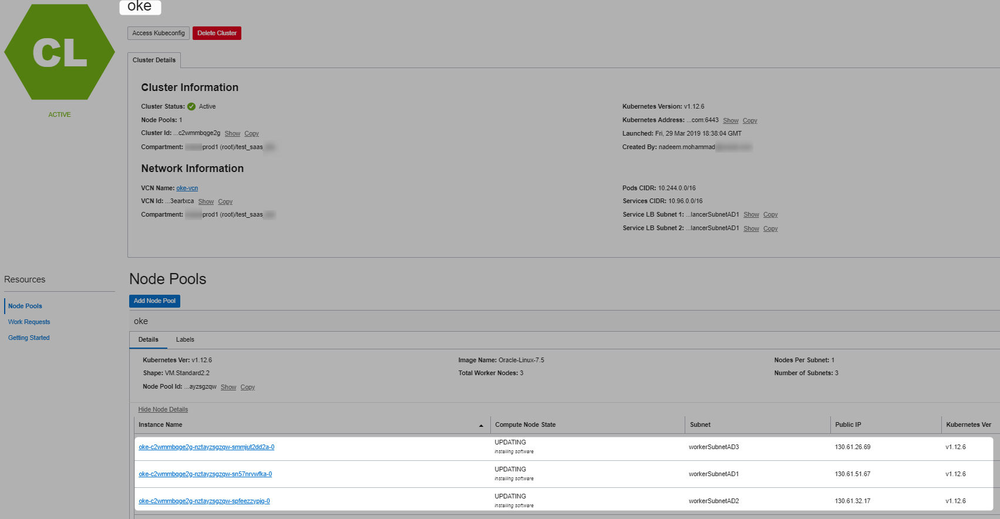

[Home](../README.md)

# Creating Kubernetes Cluster (OKE) Using Terraform On Oracle Cloud Infrastructure (OCI)

## Prerequisites

Refer [this](TerraformPrerequisites.md) for more details.

## OCI Tenancy

Refer [this](../manual/GettingOCIDs.md) to get more details on how to get details of OCI tenancy, this would be used below in **Implementation** Section below.


## Implementation


### Terraform Project




### Terraform Code

We need to create the following files

* variable.tf
* provider.tf
* outputs.tf
* datasources.tf
* network.tf
* cluster.tf
* env_vars.ps1

variable.tf
```Powershell
# Required by the OCI Provider
variable "tenancy_ocid" {}

variable "user_ocid" {}
variable "fingerprint" {}
variable "private_key_path" {}
variable "compartment_ocid" {}

variable "ssh_public_key_file" {
  default = "~/.ssh/id_rsa.pub"
}

variable "region" {
  default = "eu-frankfurt-1"
}

# Choose an Availability Domain
variable "availability_domain" {
  default = "3"
}

variable "internet_gateway_enabled" {
  default = "true"
}

variable "worker_ol_image_name" {
  default = "Oracle-Linux-7.5"
}

variable "oke" {
  type = "map"

  default = {
    name             = "oke"
    version          = "v1.12.6"
    shape            = "VM.Standard2.2"
    nodes_per_subnet = 1
  }
}

variable "network_cidrs" {
  type = "map"

  default = {
    vcnCIDR               = "10.0.0.0/16"
    workerSubnetAD1       = "10.0.10.0/24"
    workerSubnetAD2       = "10.0.11.0/24"
    workerSubnetAD3       = "10.0.12.0/24"
    LoadBalancerSubnetAD1 = "10.0.20.0/24"
    LoadBalancerSubnetAD2 = "10.0.21.0/24"
    LoadBalancerSubnetAD3 = "10.0.22.0/24"
  }
}

```

provider.tf

```Powershell
provider "oci" {
  tenancy_ocid     = "${var.tenancy_ocid}"
  user_ocid        = "${var.user_ocid}"
  fingerprint      = "${var.fingerprint}"
  private_key_path = "${var.private_key_path}"
  region           = "${var.region}"
}

```

outputs.tf

```Powershell
# Output the result
output "show-ads" {
  value = "${data.oci_identity_availability_domains.ADs.availability_domains}"
}

```

datasources.tf

```Powershell
# Gets a list of Availability Domains
data "oci_identity_availability_domains" "ADs" {
  compartment_id = "${var.compartment_ocid}"
}

data "oci_core_images" "oracle_linux_image" {
  compartment_id           = "${var.compartment_ocid}"
  operating_system         = "Oracle Linux"
  operating_system_version = "7.6"
}

```

network.tf

```Powershell
resource "oci_core_vcn" "oke_vcn" {
  #Required
  cidr_block     = "${lookup(var.network_cidrs, "vcnCIDR")}"
  compartment_id = "${var.compartment_ocid}"

  #Optional
  dns_label    = "vcn1"
  display_name = "oke-vcn"
}

resource "oci_core_security_list" "oke_sl" {
  #Required
  compartment_id = "${var.compartment_ocid}"
  vcn_id         = "${oci_core_vcn.oke_vcn.id}"

  egress_security_rules = [
    {
      destination = "0.0.0.0/0"
      protocol    = "all"
    },
  ]

  ingress_security_rules = [
    {
      protocol = "all"
      source   = "0.0.0.0/0"
    },
  ]

  #Optional
  display_name = "oke-sl"
}

resource "oci_core_internet_gateway" "oke_ig" {
  #Required
  compartment_id = "${var.compartment_ocid}"
  vcn_id         = "${oci_core_vcn.oke_vcn.id}"

  #Optional
  enabled      = "${var.internet_gateway_enabled}"
  display_name = "oke-gateway"
}

resource "oci_core_route_table" "oke_rt" {
  #Required
  compartment_id = "${var.compartment_ocid}"
  vcn_id         = "${oci_core_vcn.oke_vcn.id}"

  route_rules {
    destination       = "0.0.0.0/0"
    network_entity_id = "${oci_core_internet_gateway.oke_ig.id}"
  }

  #Optional
  display_name = "oke-rt"
}

resource "oci_core_subnet" "workerSubnetAD1" {
  #Required
  cidr_block        = "${lookup(var.network_cidrs, "workerSubnetAD1")}"
  compartment_id    = "${var.compartment_ocid}"
  security_list_ids = ["${oci_core_security_list.oke_sl.id}"]
  vcn_id            = "${oci_core_vcn.oke_vcn.id}"

  #Optional
  availability_domain = "${lookup(data.oci_identity_availability_domains.ADs.availability_domains[0], "name")}"
  dhcp_options_id     = "${oci_core_vcn.oke_vcn.default_dhcp_options_id}"
  display_name        = "workerSubnetAD1"
  dns_label           = "worker1"
  route_table_id      = "${oci_core_route_table.oke_rt.id}"
}

resource "oci_core_subnet" "workerSubnetAD2" {
  #Required
  cidr_block        = "${lookup(var.network_cidrs, "workerSubnetAD2")}"
  compartment_id    = "${var.compartment_ocid}"
  security_list_ids = ["${oci_core_security_list.oke_sl.id}"]
  vcn_id            = "${oci_core_vcn.oke_vcn.id}"

  #Optional
  availability_domain = "${lookup(data.oci_identity_availability_domains.ADs.availability_domains[1], "name")}"
  dhcp_options_id     = "${oci_core_vcn.oke_vcn.default_dhcp_options_id}"
  display_name        = "workerSubnetAD2"
  dns_label           = "worker2"
  route_table_id      = "${oci_core_route_table.oke_rt.id}"
}

resource "oci_core_subnet" "workerSubnetAD3" {
  #Required
  cidr_block        = "${lookup(var.network_cidrs, "workerSubnetAD3")}"
  compartment_id    = "${var.compartment_ocid}"
  security_list_ids = ["${oci_core_security_list.oke_sl.id}"]
  vcn_id            = "${oci_core_vcn.oke_vcn.id}"

  #Optional
  availability_domain = "${lookup(data.oci_identity_availability_domains.ADs.availability_domains[2], "name")}"
  dhcp_options_id     = "${oci_core_vcn.oke_vcn.default_dhcp_options_id}"
  display_name        = "workerSubnetAD3"
  dns_label           = "worker3"
  route_table_id      = "${oci_core_route_table.oke_rt.id}"
}

resource "oci_core_subnet" "LoadBalancerSubnetAD1" {
  #Required
  cidr_block        = "${lookup(var.network_cidrs, "LoadBalancerSubnetAD1")}"
  compartment_id    = "${var.compartment_ocid}"
  security_list_ids = ["${oci_core_security_list.oke_sl.id}"]
  vcn_id            = "${oci_core_vcn.oke_vcn.id}"

  #Optional
  availability_domain = "${lookup(data.oci_identity_availability_domains.ADs.availability_domains[0], "name")}"
  dhcp_options_id     = "${oci_core_vcn.oke_vcn.default_dhcp_options_id}"
  display_name        = "LoadBalancerSubnetAD1"
  dns_label           = "loadbalancer1"
  route_table_id      = "${oci_core_route_table.oke_rt.id}"
}

resource "oci_core_subnet" "LoadBalancerSubnetAD2" {
  #Required
  cidr_block        = "${lookup(var.network_cidrs, "LoadBalancerSubnetAD2")}"
  compartment_id    = "${var.compartment_ocid}"
  security_list_ids = ["${oci_core_security_list.oke_sl.id}"]
  vcn_id            = "${oci_core_vcn.oke_vcn.id}"

  #Optional
  availability_domain = "${lookup(data.oci_identity_availability_domains.ADs.availability_domains[1], "name")}"
  dhcp_options_id     = "${oci_core_vcn.oke_vcn.default_dhcp_options_id}"
  display_name        = "LoadBalancerSubnetAD1"
  dns_label           = "loadbalancer2"
  route_table_id      = "${oci_core_route_table.oke_rt.id}"
}

```

cluster.tf

```Powershell
# https://www.terraform.io/docs/providers/oci/r/containerengine_cluster.html
resource "oci_containerengine_cluster" "k8s_cluster" {
  #Required
  compartment_id     = "${var.compartment_ocid}"
  kubernetes_version = "${var.oke["version"]}"
  name               = "${var.oke["name"]}"
  vcn_id             = "${oci_core_vcn.oke_vcn.id}"

  #Optional
  options {
    service_lb_subnet_ids = ["${oci_core_subnet.LoadBalancerSubnetAD1.id}", "${oci_core_subnet.LoadBalancerSubnetAD2.id}"]
  }
}

# https://www.terraform.io/docs/providers/oci/r/containerengine_node_pool.html
resource "oci_containerengine_node_pool" "k8s_node_pool" {
  #Required
  cluster_id         = "${oci_containerengine_cluster.k8s_cluster.id}"
  compartment_id     = "${var.compartment_ocid}"
  kubernetes_version = "${var.oke["version"]}"
  name               = "${var.oke["name"]}"
  node_image_name    = "${var.worker_ol_image_name}"
  node_shape         = "${var.oke["shape"]}"
  subnet_ids         = ["${oci_core_subnet.workerSubnetAD1.id}", "${oci_core_subnet.workerSubnetAD2.id}", "${oci_core_subnet.workerSubnetAD3.id}"]

  quantity_per_subnet = "${var.oke["nodes_per_subnet"]}"
  ssh_public_key      = "${file(var.ssh_public_key_file)}"
}

data "oci_containerengine_cluster_kube_config" "cluster_kube_config" {
  cluster_id    = "${oci_containerengine_cluster.k8s_cluster.id}"
  expiration    = 2592000
  token_version = "1.0.0"
}

resource "local_file" "kubeconfig" {
  content  = "${data.oci_containerengine_cluster_kube_config.cluster_kube_config.content}"
  filename = "${path.module}/kubeconfig"
}

```

env_vars.ps1

```Powershell
### Authentication details
$env:TF_VAR_tenancy_ocid = "ocid1.tenancy.oc1..afsafsafsafsafadsfdsafdsaf"
$env:TF_VAR_user_ocid = "ocid1.user.oc1..asdfdsafdsafdsafdsafdsafdsafds"
$env:TF_VAR_fingerprint = "35:84:df:b5:fe:6b:81:25:e5:bf:b6:e2:66:66:b8:56"
$env:TF_VAR_private_key_path = "C:\Users\nadeem\.oci\oci_api_key.pem"
 
### Region
$env:TF_VAR_region  = "eu-frankfurt-1"
 
### Compartment
$env:TF_VAR_compartment_ocid  = "ocid1.compartment.oc1..safdsafdsafdsafdsafsdfsda"
```

Execute `terraform init`

```Powershell
PS D:\practices\terraform\oke> terraform init

Initializing provider plugins...
- Checking for available provider plugins on https://releases.hashicorp.com...
- Downloading plugin for provider "oci" (3.20.0)...
- Downloading plugin for provider "local" (1.2.0)...

The following providers do not have any version constraints in configuration,
so the latest version was installed.

To prevent automatic upgrades to new major versions that may contain breaking
changes, it is recommended to add version = "..." constraints to the
corresponding provider blocks in configuration, with the constraint strings
suggested below.

* provider.local: version = "~> 1.2"
* provider.oci: version = "~> 3.20"

Terraform has been successfully initialized!

You may now begin working with Terraform. Try running "terraform plan" to see
any changes that are required for your infrastructure. All Terraform commands
should now work.

If you ever set or change modules or backend configuration for Terraform,
rerun this command to reinitialize your working directory. If you forget, other
commands will detect it and remind you to do so if necessary.
PS D:\practices\terraform\oke>
```

Execute `terraform validate`

```Powershell
PS D:\practices\terraform\oke> terraform validate
PS D:\practices\terraform\oke>
```

Execute `terraform plan`


Execute `terraform apply`





## Clean up

Execute `terraform destroy`

```Powershell

```


# References 

* [Terraform Kubernetes Installer](https://github.com/oracle/terraform-kubernetes-installer)
* [Sample OKE For Terraform](https://github.com/oracle/sample-oke-for-terraform/blob/master/docs/instructions.md)
* [Terraform OCI provider Example](https://github.com/terraform-providers/terraform-provider-oci/tree/master/examples/container_engine)

